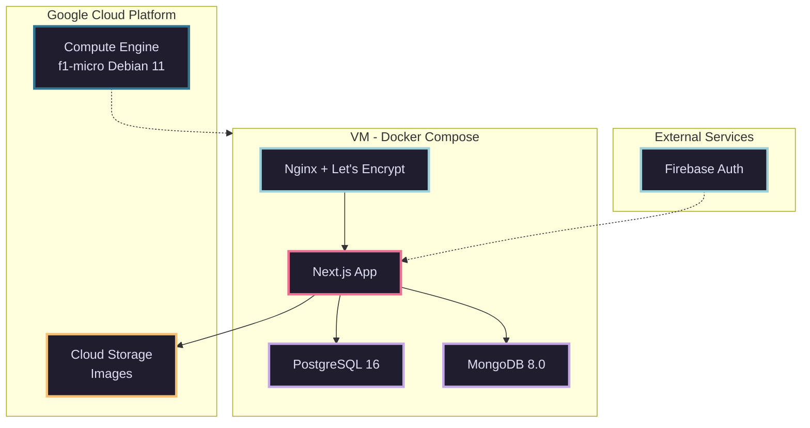
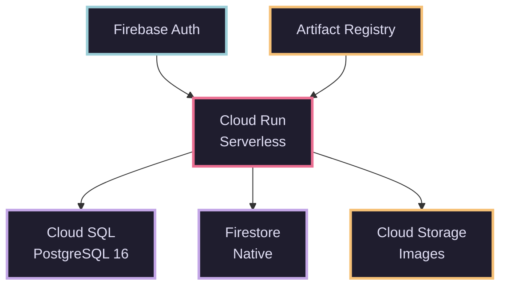

# CloudAppDev
## Milestone 1: Cloud-Native Travel Platform

IaaS vs. PaaS auf Google Cloud Platform

<div class="absolute bottom-10 left-10 text-sm opacity-75">
  <div>Simon Driescher, Samuel Behrmann, Simon Blaser</div>
</div>

---

# Travel Itinerary Management Platform

<div class="grid grid-cols-2 gap-8 mt-8">

<div>

### Kernfunktionen

- Reiserouten-Management (CRUD)
- User Authentication
- Image Upload zu Cloud Storage
- Comments & Likes System

</div>

<div>

### Tech Stack

- Next.js 15 + React 19
- PostgreSQL + MongoDB/Firestore
- Firebase Authentication
- Google Cloud Platform

</div>

</div>

<div class="absolute bottom-10 right-10 flex gap-4 items-center">
  
  
  
  
</div>

---
layout: two-cols
---

# Tech Stack

### Frontend
```typescript
// Next.js 15.5.4 + React 19
import { PrimeReact } from 'primereact'
import { Tailwind } from '@tailwindcss'
```

- PrimeReact UI Components
- Tailwind CSS


::right::

<div class="pl-8">

### Backend
```javascript
// Next.js API Routes
import { PrismaClient } from '@prisma/client'
import { MongoClient } from 'mongodb'
import { Storage } from '@google-cloud/storage'
import admin from 'firebase-admin'
```

- Prisma ORM
- MongoDB Driver
- Firebase Admin SDK
- Cloud Storage SDK

</div>

---
layout: two-cols
---

# Multi-Database Strategie

### PostgreSQL 16

```prisma
model User {
  id          Int         @id
  email       String      @unique
  googleUid   String?     @unique
  itineraries Itinerary[]
  comments    Comment[]
}

model Itinerary {
  id          Int        @id
  user_id     Int
  title       String
  locations   Location[]
}

model Location {
  id           Int      @id
  itinerary_id Int
  name         String
  images       String[]
}
```

::right::

<div class="pl-8">

### MongoDB / Firestore

```javascript
// Likes Collection
{
  _id: ObjectId,
  itineraryId: 123,
  userId: 456,
  createdAt: ISODate
}

// Comments Collection
{
  _id: ObjectId,
  itineraryId: 123,
  userId: 456,
  text: "Great route!",
  createdAt: ISODate
}
```

</div>

---
layout: center
class: text-center
---

# IaaS vs. PaaS Deployment

<div class="mt-8 text-xl">
Zwei vollständige Implementierungen auf Google Cloud Platform
</div>

---

# Architektur-Vergleich

<div class="grid grid-cols-2 gap-4">

<div>

### IaaS - Infrastructure as a Service




</div>

<div>

### PaaS - Platform as a Service



</div>

</div>

---
layout: two-cols
---

# IaaS Implementation

### Terraform Infrastructure

```hcl
resource "google_compute_instance" "vm" {
  name         = "cloudappdev-iaas"
  machine_type = "f1-micro"
  zone         = "europe-west1-b"
  
  boot_disk {
    initialize_params {
      image = "debian-cloud/debian-11"
      size  = 30
    }
  }
  
  network_interface {
    network = google_compute_network.vpc.name
    access_config {
      nat_ip = google_compute_address.static.address
    }
  }
}
```

::right::

<div class="pl-8">

### Docker Compose

```yaml
services:
  db:
    image: postgres:16
    volumes:
      - db_data:/var/lib/postgresql/data
  
  mongodb:
    image: mongo:8.0
    volumes:
      - mongo_data:/data/db
    
  frontend:
    build: .
    depends_on: [db, mongodb]
    environment:
      - FIREBASE_PROJECT_ID=${FIREBASE_PROJECT_ID}
    
  proxy:
    build: ./nginx
    ports: ["80:80", "443:443"]
    volumes:
      - letsencrypt:/etc/letsencrypt
```

</div>

---
layout: two-cols
---

# PaaS Implementation

### Cloud Run Service

```bash
gcloud run deploy cloudappdev \
  --image gcr.io/$PROJECT/app \
  --platform managed \
  --region europe-west1 \
  --allow-unauthenticated \
  --min-instances 0 \
  --max-instances 10 \
  --memory 512Mi \
  --cpu 1
```

::right::

<div class="pl-8">

### Terraform Managed Services

```hcl
resource "google_sql_database_instance" "db" {
  database_version = "POSTGRES_16"
  settings {
    tier = "db-g1-small"
    edition = "ENTERPRISE"
    backup_configuration {
      enabled = true
    }
  }
}

resource "google_firestore_database" "nosql" {
  type = "FIRESTORE_NATIVE"
  database_edition = "ENTERPRISE"
}

resource "google_storage_bucket" "images" {
  location = "EU"
  uniform_bucket_level_access = true
}
```

</div>

---

# Load Testing

<div class="grid grid-cols-2 gap-10 mt-8">

<div>

### Locust Framework

**Periodic Workload**
```
100 concurrent users
10 Minuten
Registration, Browse, CRUD
```

**Once-in-a-Lifetime**
```
1,000 concurrent users
3 Minuten
200 users/sec spawn rate
```

</div>

<div>

**Test Coverage**
- API Endpoints (CRUD)
- Database Operations
- Likes & Comments System
- Search & Pagination

**Bewusst nicht getestet**
- File Uploads (bandbreitenintensiv)
- Authentication (Firebase managed)

</div>

</div>

---

# Infrastructure as Code

<div class="grid grid-cols-2 gap-8 mt-6">

<div>

### Deployment Automation

```bash
# PowerShell / Bash Scripts
./deploy.ps1 deploy   # Full deployment
./deploy.ps1 update   # Update container
./deploy.ps1 logs     # View logs
./deploy.ps1 status   # Check health
```

**Automatisierte Schritte:**
1. Cloud SQL Setup & Migration
2. Firestore Database Creation
3. Container Build & Push (Artifact Registry)
4. Cloud Run Deployment & Environment Configuration

</div>

<div>

### Terraform Resources

```hcl
# IaaS Resources
- google_compute_instance
- google_compute_network
- google_compute_firewall
- google_compute_address

# PaaS Resources
- google_cloud_run_service
- google_sql_database_instance
- google_firestore_database
- google_storage_bucket
- google_secret_manager_secret
```

**State Management:**
- Remote Backend (GCS)
- Terraform Lock

</div>

</div>

---

# Milestone 1 - Technical Requirements

<div class="grid grid-cols-2 gap-x-16 gap-y-8 mt-12">

<div class="p-6 rounded-lg" style="background-color: #1f1d2e; border: 2px solid #524f67;">
<div class="text-xl font-bold mb-3" style="color: #e0def4;">Standard Cloud Platform</div>
<div class="text-base" style="color: #908caa;">Google Cloud Platform</div>
</div>

<div class="p-6 rounded-lg" style="background-color: #1f1d2e; border: 2px solid #3e8fb0;">
<div class="text-xl font-bold mb-3" style="color: #9ccfd8;">IaaS Terraform Deployment</div>
<div class="text-base" style="color: #908caa;">Compute Engine + Docker Compose</div>
</div>

<div class="p-6 rounded-lg" style="background-color: #1f1d2e; border: 2px solid #c4a7e7;">
<div class="text-xl font-bold mb-3" style="color: #c4a7e7;">PaaS Terraform Deployment</div>
<div class="text-base" style="color: #908caa;">Cloud Run + Managed Services</div>
</div>

<div class="p-6 rounded-lg" style="background-color: #1f1d2e; border: 2px solid #f6c177;">
<div class="text-xl font-bold mb-3" style="color: #f6c177;">Performance Testing</div>
<div class="text-base" style="color: #908caa;">Locust Scripts + Test Report (IaaS & PaaS)</div>
</div>

</div>

<div class="p-6 rounded-lg mt-8 mx-auto" style="max-width: 600px; background-color: #1f1d2e; border: 2px solid #eb6f92;">
<div class="text-xl font-bold mb-3 text-center" style="color: #eb6f92;">Multi-User Authentication</div>
<div class="text-base text-center" style="color: #908caa;">Firebase Identity Server</div>
</div>

---
layout: end
class: text-center
---

# Vielen Dank!

**CloudAppDev Milestone 1**

<div class="mt-12 text-sm opacity-75">
Next.js 15 + React 19 | PostgreSQL 16 + MongoDB 8.0<br/>
Google Cloud Platform (IaaS + PaaS) | Locust Load Testing
</div>
