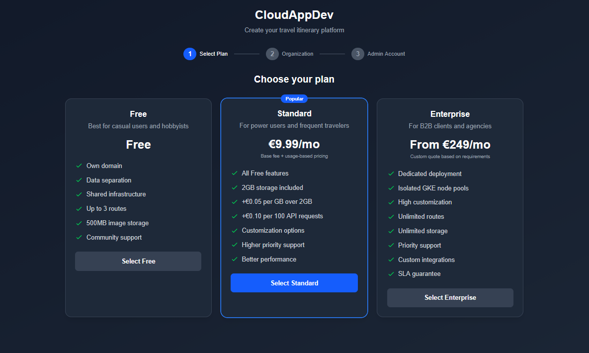

# CloudAppDev - Milestone 3
## Production-Grade SaaS

<div class="absolute bottom-10 left-10 text-sm opacity-75">
  <div>Simon Driescher, Samuel Behrmann, Simon Blaser</div>
</div>

---

# From M2 to M3

<div class="grid grid-cols-3 gap-4 mt-8 text-left text-sm">

<div class="bg-[#13121b] border border-[#2a2837] rounded-lg p-4 text-slate-200/80">
  <div class="text-base font-semibold mb-1">M1: Monolith</div>
  <ul class="space-y-1 leading-relaxed">
    <li>Cloud Run</li>
    <li>Single instance</li>
  </ul>
</div>

<div class="bg-[#13121b] border border-[#2a2837] rounded-lg p-4 text-slate-200/80">
  <div class="text-base font-semibold mb-1">M2: Microservices</div>
  <ul class="space-y-1 leading-relaxed">
    <li>GKE + 5 services</li>
    <li>Shared infrastructure</li>
  </ul>
</div>

<div class="bg-[#1f1d2e] border-2 border-[#c4a7e7] rounded-lg p-5 shadow-[0_10px_40px_rgba(196,167,231,0.2)]">
  <div class="text-base font-semibold text-[#c4a7e7] mb-1">M3: SaaS</div>
  <ul class="space-y-1 leading-relaxed">
    <li>Multi-Tenancy</li>
    <li>Auto-Provisioning</li>
    <li>Financial Model</li>
    <li>Infrastructure</li>
  </ul>
</div>

</div>

<div v-click class="grid grid-cols-3 gap-4 mt-8">

<div style="background-color: #1f1d2e; border: 2px solid #f6c177; padding: 1rem; border-radius: 0.5rem;">
<div style="color: #f6c177; font-weight: bold; margin-bottom: 0.5rem;">FREE</div>
<div style="font-size: 0.8em; color: #908caa;">
Shared namespace<br/>
3 routes, 500MB storage<br/>
Best Effort<br/>
€0/month
</div>
</div>

<div style="background-color: #1f1d2e; border: 2px solid #9ccfd8; padding: 1rem; border-radius: 0.5rem;">
<div style="color: #9ccfd8; font-weight: bold; margin-bottom: 0.5rem;">STANDARD</div>
<div style="font-size: 0.8em; color: #908caa;">
Shared namespace<br/>
Higher priority support<br/>
99.5% SLA<br/>
€9,99/month + usage
</div>
</div>

<div style="background-color: #1f1d2e; border: 2px solid #eb6f92; padding: 1rem; border-radius: 0.5rem;">
<div style="color: #eb6f92; font-weight: bold; margin-bottom: 0.5rem;">ENTERPRISE</div>
<div style="font-size: 0.8em; color: #908caa;">
Dedicated namespace<br/>
Dedicated infrastructure<br/>
99.99% SLA<br/>
€249+/month custom
</div>
</div>

</div>

---

# Tenant Registration

<div class="flex justify-center items-center h-full">
  
</div>

---

# New Services (M3)

<div style="margin-top: 3rem; display: grid; grid-template-columns: 1fr 1fr; gap: 2rem;">

<div style="background-color: #1f1d2e; border-left: 4px solid #c4a7e7; padding: 1.5rem; border-radius: 0.25rem;">

**Tenant Service** (8084)
- Registration & login
- Namespace validation
- JWT auth (bcrypt)
- Manage tenant metadata

Stack: NestJS + PostgreSQL

</div>

<div style="background-color: #1f1d2e; border-left: 4px solid #f6c177; padding: 1.5rem; border-radius: 0.25rem;">

**Provisioning Service**
- Infrastructure orchestration
- Terraform runner
- K8s namespace deployer
- Domain + SSL provisioning

Stack: NestJS + Terraform + K8s

</div>

</div>

---

# Registration & Provisioning Flow

<div class="flex justify-center items-center h-full">
  <div style="background-color: #ffffff; padding: 2rem; border-radius: 0.5rem; box-shadow: 0 10px 40px rgba(0,0,0,0.35);">
    
  </div>
</div>

---

# Two-Level Authentication

<div style="margin-top: 2rem; font-size: 0.9em;">

```
Level 1: Tenant Auth (Port 8084)
  Email + Password → JWT(tenant_id, tier)
       ↓
Level 2: User Auth (Per-Tenant)
  User credentials → JWT(tenant_id, user_id)
  Namespace enforcement on all requests
```

<div style="margin-top: 2rem; color: #c4a7e7;">

**Key Enforcements:**
- Cross-tenant access blocked
- Database queries filtered by tenant
- Namespace-based data isolation

</div>

</div>

---

<div class="flex justify-center items-center h-full">
  
</div>


---

# Security Highlights

<div class="mt-6 grid grid-cols-2 gap-4 text-left text-sm">

  <div class="bg-[#1f1d2e] border border-[#2a2837] rounded-lg p-4">
    <div class="text-[#9ccfd8] font-semibold mb-2">Implemented (M3)</div>
    <ul class="space-y-1 text-slate-300/90 leading-relaxed">
      <li>JWT-based tenant + user auth</li>
      <li>Per-request tenant scoping enforced in APIs</li>
      <li>No secrets checked into repo (env/secret refs)</li>
    </ul>
  </div>

  <div class="bg-[#1f1d2e] border border-[#2a2837] rounded-lg p-4">
    <div class="text-[#f6c177] font-semibold mb-2">Isolation</div>
    <ul class="space-y-1 text-slate-300/90 leading-relaxed">
      <li>Namespaces per tier; dedicated namespaces for Enterprise</li>
      <li>Service-to-service calls gated by tenant context</li>
      <li>Gateway blocks cross-tenant access paths</li>
    </ul>
  </div>

  <div class="bg-[#1f1d2e] border border-[#2a2837] rounded-lg p-4">
    <div class="text-[#eb6f92] font-semibold mb-2">Reliability & Secrets</div>
    <ul class="space-y-1 text-slate-300/90 leading-relaxed">
      <li>HTTPS termination at gateway/ingress</li>
      <li>K8s secrets for service creds; rotation playbook WIP</li>
      <li>Health checks + alerts wired into CI/CD</li>
    </ul>
  </div>

</div>

---

# Financial Model (Dynamic Pricing)

<div class="mt-6 grid grid-cols-3 gap-4 text-left text-sm">

  <div class="bg-[#1f1d2e] border border-[#2a2837] rounded-lg p-4 shadow-[0_10px_25px_rgba(0,0,0,0.25)]">
    <div class="text-[#f6c177] text-lg font-semibold mb-1">Free</div>
    <div class="text-2xl font-bold text-slate-100 mb-2">€0<span class="text-sm text-slate-400">/month</span></div>
    <ul class="space-y-1 text-slate-300/90 leading-relaxed">
      <li>Limits: 3 routes, 500MB</li>
      <li>Cost: ~€5/tenant</li>
      <li class="text-[#f6c177] font-medium">Margin: Negative</li>
      <li class="text-slate-400">Acquisition & upsell</li>
    </ul>
  </div>

  <div class="bg-[#1f1d2e] border border-[#2a2837] rounded-lg p-4 shadow-[0_10px_25px_rgba(0,0,0,0.25)]">
    <div class="text-[#9ccfd8] text-lg font-semibold mb-1">Standard</div>
    <div class="text-2xl font-bold text-slate-100 mb-2">€9,99<span class="text-sm text-slate-400">/month</span></div>
    <ul class="space-y-1 text-slate-300/90 leading-relaxed">
      <li>+ €0.05/GB (>2GB)</li>
      <li>+ €0.10 per 100 API calls</li>
      <li>Cost: ~€30/tenant</li>
      <li class="text-[#9ccfd8] font-medium">Margin: ~70% (volume)</li>
    </ul>
  </div>

  <div class="bg-[#1f1d2e] border border-[#2a2837] rounded-lg p-4 shadow-[0_10px_25px_rgba(0,0,0,0.25)]">
    <div class="text-[#eb6f92] text-lg font-semibold mb-1">Enterprise</div>
    <div class="text-2xl font-bold text-slate-100 mb-2">€249+<span class="text-sm text-slate-400">/month</span></div>
    <ul class="space-y-1 text-slate-300/90 leading-relaxed">
      <li>Dedicated infra + SLOs</li>
      <li>Custom features & routing</li>
      <li>Cost: ~€150+/tenant</li>
      <li class="text-[#eb6f92] font-medium">Margin: 30-50% (strategic)</li>
    </ul>
  </div>

</div>

<div class="mt-4 grid grid-cols-3 gap-3 text-xs text-left text-slate-200/90">
  <div class="bg-[#0e0d14]/70 border border-[#2a2837] rounded-md p-3">
    <div class="text-[#c4a7e7] font-semibold mb-1">Infra Baseline</div>
    <div>€103,39/month</div>
    <div class="text-slate-400">GKE, storage, secrets, monitoring</div>
  </div>
  <div class="bg-[#0e0d14]/70 border border-[#2a2837] rounded-md p-3">
    <div class="text-[#c4a7e7] font-semibold mb-1">Profit Target</div>
    <div>€415+/month (75% margin)</div>
    <div class="text-slate-400">Break-even @ 6× Standard</div>
  </div>
  <div class="bg-[#0e0d14]/70 border border-[#2a2837] rounded-md p-3">
    <div class="text-[#c4a7e7] font-semibold mb-1">Telemetry</div>
    <div>Per-tenant usage metered</div>
    <div class="text-slate-400">Pipeline → billing & alerts</div>
  </div>
</div>

---

# Continuous Delivery

<div class="mt-6 grid grid-cols-2 gap-4 text-left text-sm">

  <div class="bg-[#1f1d2e] border border-[#2a2837] rounded-lg p-4 shadow-[0_10px_25px_rgba(0,0,0,0.25)]">
    <div class="text-[#9ccfd8] font-semibold mb-2">develop → Dev/Staging</div>
    <ul class="space-y-1 text-slate-300/90 leading-relaxed">
      <li>Paths-filtered: build only changed services (matrix)</li>
      <li>Docker build & push to Artifact Registry</li>
      <li>Helm deploy per changed service to dev namespaces</li>
      <li>Secrets pulled from GCP Secret Manager during deploy</li>
      <li>Version tags: latest + 0.0.x + sha</li>
    </ul>
  </div>

  <div class="bg-[#1f1d2e] border border-[#2a2837] rounded-lg p-4 shadow-[0_10px_25px_rgba(0,0,0,0.25)]">
    <div class="text-[#f6c177] font-semibold mb-2">Tags → Prod Images</div>
    <ul class="space-y-1 text-slate-300/90 leading-relaxed">
      <li>Git tag push builds all services (no diffs)</li>
      <li>Images tagged latest + semver + sha</li>
      <li>No automated prod deploy in workflow (manual step)</li>
      <li>Summary advises updating manifests/Helm values</li>
    </ul>
  </div>

</div>

<div class="mt-4 grid grid-cols-3 gap-3 text-xs text-left text-slate-200/90">
  <div class="bg-[#0e0d14]/70 border border-[#2a2837] rounded-md p-3">
    <div class="text-[#c4a7e7] font-semibold mb-1">IaC</div>
    <div>Terraform + versioned K8s manifests</div>
    <div class="text-slate-400">State per env; secrets via GCP Secret Manager</div>
  </div>
  <div class="bg-[#0e0d14]/70 border border-[#2a2837] rounded-md p-3">
    <div class="text-[#c4a7e7] font-semibold mb-1">Selective CI</div>
    <div>Service diffs drive dev builds/deploy scope</div>
    <div class="text-slate-400">Prod always builds all on tag</div>
  </div>
  <div class="bg-[#0e0d14]/70 border border-[#2a2837] rounded-md p-3">
    <div class="text-[#c4a7e7] font-semibold mb-1">Deploy Notes</div>
    <div>Dev: Helm per service to mapped namespaces</div>
    <div class="text-slate-400">Prod: manual deploy after images built</div>
  </div>
</div>


---

# Thank You!

**CloudAppDev Milestone 3**

<div class="mt-12 text-sm opacity-75">
Production-Grade SaaS | Multi-Tenancy | Continuous Delivery<br/>
Automated Provisioning | Financial Analytics | Enterprise Security<br/>
NestJS + Prisma | PostgreSQL 16 + MongoDB | Google Kubernetes Engine
</div>
