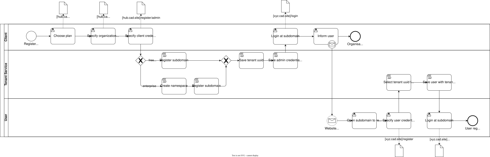

# CloudAppDev - Milestone 3
## Production-Grade SaaS

  
Simon Driescher, Samuel Behrmann, Simon Blaser

---

# From M2 to M3

  
M1: Monolith

  <ul class="space-y-1 leading-relaxed">
    <li>Cloud Run</li>
    <li>Single instance</li>
  </ul>

  
M2: Microservices

  <ul class="space-y-1 leading-relaxed">
    <li>GKE + 5 services</li>
    <li>Shared infrastructure</li>
  </ul>

  
M3: SaaS

  <ul class="space-y-1 leading-relaxed">
    <li>Multi-Tenancy</li>
    <li>Auto-Provisioning</li>
    <li>Financial Model</li>
    <li>Infrastructure</li>
  </ul>

FREE

Shared namespace 
3 routes, 500MB storage 
Best Effort 
€0/month

STANDARD

Shared namespace 
Higher priority support 
99.5% SLA 
€9,99/month + usage

ENTERPRISE

Dedicated namespace 
Dedicated infrastructure 
99.99% SLA 
€249+/month custom

---
background: '#ffffff'
---

# Registration & Provisioning Flow

  

    
  

---

# New Services (M3)

**Tenant Service** (8084)
- Registration & login
- Namespace validation
- JWT auth (bcrypt)
- Manage tenant metadata

Stack: NestJS + PostgreSQL

**Provisioning Service**
- Infrastructure orchestration
- Terraform runner
- K8s namespace deployer
- Domain + SSL provisioning

Stack: NestJS + Terraform + K8s

---

  <a href="https://raw.githubusercontent.com/CloudAppDevProject/CloudAppDev/develop/docs/microservice_architecture.drawio.svg" target="_blank" rel="noopener noreferrer" class="text-sm text-[#9ccfd8] hover:text-[#c4a7e7] transition-colors">Ref
  </a>

---

# Dataflow Infrastructure

  <a href="https://raw.githubusercontent.com/CloudAppDevProject/CloudAppDev/develop/docs/dataflow_diagram.drawio.svg" target="_blank" rel="noopener noreferrer">
    

      
    

  </a>

---

# Thank You!

**CloudAppDev Milestone 3**

Production-Grade SaaS | Multi-Tenancy | Continuous Delivery 
Automated Provisioning | Financial Analytics | Enterprise Security 
NestJS + Prisma | PostgreSQL 16 + MongoDB | Google Kubernetes Engine

