# Cloud Native Project Report


## 1 Requirements
<!-- Requirements: Give a short introduction into the system scope and main features. -->


### 1.1 System Context
The following diagram shows the system context containing an User, the application, an external Weather provider and an external geolocation service.


#### 1.1.1 User
The user interacts with the application by planning, creating and viewing itineraries. These can either be his own or from other users.

#### 1.1.2 Weather provider
The weather provider is an open api which can be accessed with an api key to obtain the current weather aswell as the forecast for up to 7 days.

#### 1.1.3 Geographic location provider
Another Public api which serves latitude and longitude for a certain City or
the City for a given pair of coordinates. 


### 1.2 Feature Overview
The application is a cloud-native travel planning platform that enables travelers to create, share, and discover travel itineraries. The main features include:

**User Management**: Travelers can register with their email and name, create personal profiles, and upload profile images to personalize their accounts.

**Itinerary Management**: Users can create detailed itineraries for their trips, including title, destination, start date, descriptions, and multiple travel locations. Each location can have date ranges, descriptions, and associated images. Travelers can view and manage all their itineraries from a centralized dashboard.

**Interactive Maps**: The platform integrates map functionality allowing users to select locations directly from a map interface when planning their itineraries. All locations within an itinerary are displayed on an interactive map with clickable markers showing location details.

**Search and Discovery**: Registered travelers can search for itineraries created by other users using various search criteria, enabling trip inspiration and travel planning research.

**Social Interaction**: Travelers can engage with each other's content through likes and comments on itineraries. Each itinerary displays the number of likes received and users can view associated comments, fostering a community-driven travel planning experience.

**Personalized Newsletter**: Users can subscribe to personalized newsletters featuring content from travelers with similar interests and travel profiles, providing relevant inspiration based on their preferences and past travel behavior.

**Weather-Based Insights**: The platform provides weather forecasts and practical advice for destinations on user itineraries, including warnings for severe conditions and activity recommendations based on weather patterns.


## 2 Development View


### 2.1 Software Components
<!-- Simon B -->
<!-- Requirements: Describe repositories, organization, software components, languages, frameworks, libraries, and external interfaces. -->

#### Repository Organization

The repository follows a microservices architecture with a monorepo structure organized into the following main components:

- **`/app`** - Next.js frontend application with React components, API routes, and UI pages
- **`/services`** - Backend microservices (user-service, itinerary-service, social-service, travel-info-service, seeder)
- **`/nginx`** - API Gateway and reverse proxy configuration
- **`/k8s`** - Kubernetes deployment manifests and configuration files
- **`/terraform`** - Infrastructure-as-Code for Google Cloud Platform provisioning
- **`/locust`** - Performance testing and load testing scripts
- **`/docs`** - Project documentation and reports
- **`/seed-data`** - Initial dataset for database seeding

#### Software Components and Languages

**Frontend Application (Next.js)**
- **Language**: TypeScript/JavaScript (React 19.1.0, Next.js 15.5.4)
- **Framework**: Next.js with App Router architecture
- **Key Libraries**:
  - **UI Framework**: PrimeReact 10.9.7 for component library
  - **Styling**: Tailwind CSS 4 for utility-first CSS
  - **State Management**: React Context API (UserContext)
  - **Authentication**: JWT handling via jose library
  - **Maps**: Leaflet 1.9.4 with react-leaflet 5.0.0 for interactive maps
  - **Theme Management**: next-themes 0.4.6 for dark/light mode
- **Component Structure**: 
  - UI Components: CommentSection, LikeButton, LocationMap, LocationMapPicker, ProfileForm, ItineraryTable
  - Layout Components: Footer, Menu, Theme Provider

**Backend Microservices (NestJS)**

All backend services are built with NestJS 11.0.1 framework using TypeScript 5.7.3 and follow a consistent architecture pattern.

1. **User Service** (Port 8080)
   - **Purpose**: User authentication, registration, profile management
   - **Key Libraries**:
     - **Authentication**: @nestjs/jwt, @nestjs/passport, passport-jwt, bcrypt for password hashing
     - **Database ORM**: Prisma 6.19.0 with PostgreSQL
     - **Firebase Integration**: firebase-admin 13.5.0 for token validation
     - **File Storage**: @google-cloud/storage 7.17.2 for profile image uploads
     - **Validation**: class-validator, class-transformer

2. **Itinerary Service** (Port 8081)
   - **Purpose**: Travel itinerary CRUD operations, locations, image management
   - **Key Libraries**:
     - **Database ORM**: Prisma 6.19.0 with PostgreSQL
     - **File Storage**: @google-cloud/storage 7.17.2 for location images
     - **Validation**: class-validator, class-transformer

3. **Social Service** (Port 8082)
   - **Purpose**: Likes, comments, newsletter subscriptions and distribution
   - **Key Libraries**:
     - **Database ODM**: Mongoose 8.8.4 for MongoDB
     - **Email Services**: @sendgrid/mail 8.1.0, nodemailer 6.9.0
     - **Template Engine**: Handlebars 4.7.7 for email templates
     - **CLI Tools**: Newsletter management commands (send-weekly, send-monthly)

4. **Travel Info Service** (Port 8083)
   - **Purpose**: Weather data and travel information integration
   - **Key Libraries**:
     - **HTTP Client**: @nestjs/axios 4.0.1, axios 1.13.2 for external API calls

5. **Seeder Service**
   - **Purpose**: Unified database initialization and seeding for all services
   - **Technologies**: Supports PostgreSQL (via Prisma) and MongoDB seeding

**API Gateway (NGINX)**
- **Purpose**: Centralized routing, load balancing, and request forwarding
- **Port**: 8000 (external), routes to internal microservices
- **Features**: 
  - Dynamic DNS resolution for Docker environments
  - Upstream definitions for all microservices
  - Support for 50MB file uploads
  - Fallback routing for local development

#### External Interfaces

**Cloud Services Integration:**
- **Google Cloud Storage**: Profile and itinerary image storage
- **Firebase Admin SDK**: Authentication and token validation
- **SendGrid API**: Transactional and newsletter email delivery
- **Weather APIs**: External weather data providers (via Travel Info Service)

**Database Interfaces:**
- **PostgreSQL 16**: Relational data for users and itineraries
  - User Service: users_db (Port 5433)
  - Itinerary Service: itineraries_db (Port 5434)
- **MongoDB**: Document storage for social interactions (likes, comments, newsletter data) (Port 27017)

**Inter-Service Communication:**
- REST APIs through API Gateway at `http://gateway:8000/api/v1/{service}`
- Service-to-service calls routed through NGINX reverse proxy
- Synchronous HTTP communication pattern

**Frontend-Backend Interface:**
- Next.js API routes in `/app/api` act as BFF (Backend for Frontend)
- RESTful API endpoints for all CRUD operations
- JWT-based authentication flow
- File upload endpoints for multipart/form-data handling

**Development and Deployment:**
- **Containerization**: Docker with multi-stage builds for each service
- **Orchestration**: Kubernetes manifests for GKE deployment
- **Infrastructure**: Terraform for GCP resource provisioning
- **Testing**: Locust for performance and load testing


### 2.2 Data Model
<!-- Simon B -->
<!-- Requirements: Describe persistent data storages and corresponding data models (ER-Diagram, JSON Schema, etc.). -->

The application uses a polyglot persistence approach with PostgreSQL for relational data and MongoDB for document-based social interactions and newsletter management.

#### PostgreSQL Databases

**User Service Database (users_db)**

Stores user account information and authentication data.

*User Entity:*
```json
{
  "$schema": "http://json-schema.org/draft-07/schema#",
  "title": "User",
  "type": "object",
  "properties": {
    "id": {
      "type": "integer",
      "description": "Auto-incrementing primary key"
    },
    "name": {
      "type": "string",
      "description": "User's full name"
    },
    "email": {
      "type": "string",
      "format": "email",
      "description": "User's email address (unique)"
    },
    "password": {
      "type": ["string", "null"],
      "description": "Hashed password (nullable for OAuth users)"
    },
    "googleUid": {
      "type": ["string", "null"],
      "description": "Google OAuth unique identifier (unique)"
    },
    "avatarUrl": {
      "type": ["string", "null"],
      "maxLength": 500,
      "description": "URL to user's profile image in Google Cloud Storage"
    },
    "createdAt": {
      "type": "string",
      "format": "date-time",
      "description": "Account creation timestamp"
    },
    "updatedAt": {
      "type": "string",
      "format": "date-time",
      "description": "Last update timestamp"
    }
  },
  "required": ["id", "name", "email", "createdAt", "updatedAt"],
  "indexes": ["email", "googleUid"]
}
```

**Itinerary Service Database (itineraries_db)**

Stores travel itineraries and associated locations.

*Itinerary Entity:*
```json
{
  "$schema": "http://json-schema.org/draft-07/schema#",
  "title": "Itinerary",
  "type": "object",
  "properties": {
    "id": {
      "type": "integer",
      "description": "Auto-incrementing primary key"
    },
    "user_id": {
      "type": "integer",
      "description": "Foreign key reference to User.id"
    },
    "title": {
      "type": "string",
      "description": "Itinerary title (e.g., 'Family Trip to Norway')"
    },
    "destination": {
      "type": "string",
      "description": "Primary destination"
    },
    "start_date": {
      "type": "string",
      "description": "Trip start date"
    },
    "short_desc": {
      "type": ["string", "null"],
      "maxLength": 80,
      "description": "Brief description (max 80 characters)"
    },
    "detail_desc": {
      "type": ["string", "null"],
      "description": "Detailed trip description"
    },
    "created_at": {
      "type": "string",
      "format": "date-time",
      "description": "Creation timestamp"
    },
    "updated_at": {
      "type": "string",
      "format": "date-time",
      "description": "Last update timestamp"
    },
    "locations": {
      "type": "array",
      "items": {
        "$ref": "#/definitions/Location"
      },
      "description": "Array of locations in this itinerary"
    }
  },
  "required": ["id", "user_id", "title", "destination", "start_date", "created_at", "updated_at"],
  "indexes": ["user_id", "destination", "created_at"]
}
```

*Location Entity:*
```json
{
  "$schema": "http://json-schema.org/draft-07/schema#",
  "title": "Location",
  "type": "object",
  "properties": {
    "id": {
      "type": "integer",
      "description": "Auto-incrementing primary key"
    },
    "itinerary_id": {
      "type": "integer",
      "description": "Foreign key reference to Itinerary.id (cascade delete)"
    },
    "name": {
      "type": "string",
      "description": "Location name"
    },
    "start_date": {
      "type": "string",
      "description": "Location visit start date"
    },
    "end_date": {
      "type": "string",
      "description": "Location visit end date"
    },
    "short_desc": {
      "type": ["string", "null"],
      "description": "Brief location description"
    },
    "images": {
      "type": "array",
      "items": {
        "type": "string",
        "maxLength": 500
      },
      "description": "Array of image URLs in Google Cloud Storage"
    },
    "latitude": {
      "type": ["number", "null"],
      "description": "Geographic latitude coordinate"
    },
    "longitude": {
      "type": ["number", "null"],
      "description": "Geographic longitude coordinate"
    },
    "created_at": {
      "type": "string",
      "format": "date-time",
      "description": "Creation timestamp"
    }
  },
  "required": ["id", "itinerary_id", "name", "start_date", "end_date", "created_at"],
  "indexes": ["itinerary_id"]
}
```

#### MongoDB Collections

**Social Service Database**

Stores social interactions, user preferences, and newsletter data.

*Like Collection:*
```json
{
  "$schema": "http://json-schema.org/draft-07/schema#",
  "title": "Like",
  "type": "object",
  "properties": {
    "_id": {
      "type": "string",
      "description": "MongoDB ObjectId"
    },
    "userId": {
      "type": "integer",
      "description": "Reference to User.id"
    },
    "itineraryId": {
      "type": "integer",
      "description": "Reference to Itinerary.id"
    },
    "createdAt": {
      "type": "string",
      "format": "date-time",
      "description": "Like timestamp"
    }
  },
  "required": ["userId", "itineraryId", "createdAt"],
  "indexes": [
    {
      "fields": ["userId", "itineraryId"],
      "unique": true,
      "description": "Ensures one like per user per itinerary"
    }
  ]
}
```

*Comment Collection:*
```json
{
  "$schema": "http://json-schema.org/draft-07/schema#",
  "title": "Comment",
  "type": "object",
  "properties": {
    "_id": {
      "type": "string",
      "description": "MongoDB ObjectId"
    },
    "userId": {
      "type": "integer",
      "description": "Reference to User.id"
    },
    "itineraryId": {
      "type": "integer",
      "description": "Reference to Itinerary.id"
    },
    "text": {
      "type": "string",
      "description": "Comment text content"
    },
    "createdAt": {
      "type": "string",
      "format": "date-time",
      "description": "Comment creation timestamp"
    },
    "updatedAt": {
      "type": "string",
      "format": "date-time",
      "description": "Last update timestamp"
    }
  },
  "required": ["userId", "itineraryId", "text", "createdAt", "updatedAt"],
  "indexes": [
    {
      "fields": ["itineraryId", "createdAt"],
      "description": "Efficient querying of comments by itinerary"
    }
  ]
}
```

*UserInterests Collection:*
```json
{
  "$schema": "http://json-schema.org/draft-07/schema#",
  "title": "UserInterests",
  "type": "object",
  "description": "Tracks user preferences from liked itineraries for personalized recommendations",
  "properties": {
    "_id": {
      "type": "string",
      "description": "MongoDB ObjectId"
    },
    "userId": {
      "type": "integer",
      "description": "Reference to User.id (unique)"
    },
    "likedKeywords": {
      "type": "array",
      "items": {
        "type": "object",
        "properties": {
          "keyword": {
            "type": "string",
            "description": "Extracted keyword from liked itineraries"
          },
          "frequency": {
            "type": "integer",
            "minimum": 1,
            "description": "Number of times this keyword appeared"
          },
          "lastSeen": {
            "type": "string",
            "format": "date-time",
            "description": "Last time this keyword was encountered"
          }
        },
        "required": ["keyword", "frequency", "lastSeen"]
      },
      "description": "Keywords from liked itinerary titles and descriptions"
    },
    "likedTags": {
      "type": "array",
      "items": {
        "type": "string"
      },
      "description": "Tags from liked itineraries"
    },
    "preferredDestinations": {
      "type": "array",
      "items": {
        "type": "string"
      },
      "description": "Destination preferences from liked itineraries"
    },
    "totalLikedItineraries": {
      "type": "integer",
      "minimum": 0,
      "description": "Total count of liked itineraries for normalization"
    },
    "lastComputedAt": {
      "type": "string",
      "format": "date-time",
      "description": "Last interest computation timestamp"
    },
    "createdAt": {
      "type": "string",
      "format": "date-time"
    },
    "updatedAt": {
      "type": "string",
      "format": "date-time"
    }
  },
  "required": ["userId", "totalLikedItineraries", "lastComputedAt"],
  "indexes": ["userId", "likedKeywords.keyword"]
}
```

*TrendingItinerary Collection:*
```json
{
  "$schema": "http://json-schema.org/draft-07/schema#",
  "title": "TrendingItinerary",
  "type": "object",
  "description": "Cached itinerary details with enriched metadata for newsletter content",
  "properties": {
    "_id": {
      "type": "string",
      "description": "MongoDB ObjectId"
    },
    "itineraryId": {
      "type": "integer",
      "description": "Reference to Itinerary.id (unique)"
    },
    "title": {
      "type": "string",
      "description": "Itinerary title"
    },
    "description": {
      "type": ["string", "null"],
      "description": "Itinerary description"
    },
    "userId": {
      "type": "integer",
      "description": "Reference to User.id"
    },
    "userName": {
      "type": ["string", "null"],
      "description": "Cached user name"
    },
    "likeCount": {
      "type": "integer",
      "minimum": 0,
      "description": "Total likes count"
    },
    "commentCount": {
      "type": "integer",
      "minimum": 0,
      "description": "Total comments count"
    },
    "score": {
      "type": "number",
      "description": "Computed trending score based on likes, comments, and recency"
    },
    "locations": {
      "type": "array",
      "items": {
        "type": "object",
        "properties": {
          "id": {
            "type": "integer"
          },
          "name": {
            "type": "string"
          },
          "description": {
            "type": ["string", "null"]
          },
          "latitude": {
            "type": ["number", "null"]
          },
          "longitude": {
            "type": ["number", "null"]
          }
        },
        "required": ["id", "name"]
      },
      "description": "Location details from itinerary"
    },
    "images": {
      "type": "array",
      "items": {
        "type": "object",
        "properties": {
          "url": {
            "type": "string"
          },
          "description": {
            "type": ["string", "null"]
          },
          "uploadedAt": {
            "type": ["string", "null"],
            "format": "date-time"
          }
        },
        "required": ["url"]
      },
      "description": "Image metadata"
    },
    "keywords": {
      "type": "array",
      "items": {
        "type": "string"
      },
      "description": "Extracted keywords for recommendation matching"
    },
    "tags": {
      "type": "array",
      "items": {
        "type": "string"
      },
      "description": "Categorization tags"
    },
    "recentComments": {
      "type": "array",
      "items": {
        "type": "object",
        "properties": {
          "userId": {
            "type": "integer"
          },
          "userName": {
            "type": ["string", "null"]
          },
          "text": {
            "type": "string"
          },
          "createdAt": {
            "type": "string",
            "format": "date-time"
          }
        },
        "required": ["userId", "text", "createdAt"]
      },
      "description": "Preview of recent comments"
    },
    "trendingComputedAt": {
      "type": "string",
      "format": "date-time",
      "description": "Timestamp of trending score computation"
    },
    "createdAt": {
      "type": "string",
      "format": "date-time"
    },
    "updatedAt": {
      "type": "string",
      "format": "date-time"
    }
  },
  "required": ["itineraryId", "title", "userId", "likeCount", "commentCount", "score", "trendingComputedAt"],
  "indexes": [
    ["score", "trendingComputedAt"],
    "keywords",
    "tags",
    "userId"
  ]
}
```

*NewsletterSubscription Collection:*
```json
{
  "$schema": "http://json-schema.org/draft-07/schema#",
  "title": "NewsletterSubscription",
  "type": "object",
  "properties": {
    "_id": {
      "type": "string",
      "description": "MongoDB ObjectId"
    },
    "userId": {
      "type": "integer",
      "description": "Reference to User.id (unique)"
    },
    "isSubscribed": {
      "type": "boolean",
      "default": true,
      "description": "Subscription active status"
    },
    "frequency": {
      "type": "string",
      "enum": ["weekly", "biweekly", "monthly"],
      "default": "weekly",
      "description": "Newsletter delivery frequency"
    },
    "includeTrending": {
      "type": "boolean",
      "default": true,
      "description": "Include trending itineraries section"
    },
    "includeRecommendations": {
      "type": "boolean",
      "default": true,
      "description": "Include personalized recommendations"
    },
    "includeActivitySummary": {
      "type": "boolean",
      "default": true,
      "description": "Include user activity summary"
    },
    "recommendationCount": {
      "type": "integer",
      "minimum": 1,
      "maximum": 20,
      "default": 5,
      "description": "Number of recommendations to include"
    },
    "createdAt": {
      "type": "string",
      "format": "date-time"
    },
    "updatedAt": {
      "type": "string",
      "format": "date-time"
    }
  },
  "required": ["userId", "isSubscribed", "frequency", "recommendationCount"],
  "indexes": [
    ["isSubscribed", "frequency"]
  ]
}
```

*NewsletterDelivery Collection:*
```json
{
  "$schema": "http://json-schema.org/draft-07/schema#",
  "title": "NewsletterDelivery",
  "type": "object",
  "description": "Tracks individual newsletter delivery attempts and status",
  "properties": {
    "_id": {
      "type": "string",
      "description": "MongoDB ObjectId"
    },
    "sendRun": {
      "type": "string",
      "description": "MongoDB ObjectId grouping deliveries in same batch"
    },
    "userId": {
      "type": "integer",
      "description": "Reference to User.id"
    },
    "email": {
      "type": "string",
      "format": "email",
      "description": "Recipient email address"
    },
    "status": {
      "type": "string",
      "enum": ["pending", "sent", "failed"],
      "default": "pending",
      "description": "Delivery status"
    },
    "error": {
      "type": ["string", "null"],
      "description": "Error message if delivery failed"
    },
    "retryCount": {
      "type": "integer",
      "minimum": 0,
      "default": 0,
      "description": "Number of retry attempts"
    },
    "sentAt": {
      "type": ["string", "null"],
      "format": "date-time",
      "description": "Successful delivery timestamp"
    },
    "createdAt": {
      "type": "string",
      "format": "date-time"
    },
    "updatedAt": {
      "type": "string",
      "format": "date-time"
    }
  },
  "required": ["sendRun", "userId", "email", "status", "retryCount"],
  "indexes": [
    ["sendRun", "status"],
    ["status", "retryCount", "updatedAt"],
    ["userId", "createdAt"]
  ]
}
```

#### Entity Relationships

**Cross-Database Relationships:**
- `Itinerary.user_id` → `User.id` (PostgreSQL to PostgreSQL)
- `Location.itinerary_id` → `Itinerary.id` (PostgreSQL, cascade delete)
- `Like.userId` → `User.id` (MongoDB to PostgreSQL reference)
- `Like.itineraryId` → `Itinerary.id` (MongoDB to PostgreSQL reference)
- `Comment.userId` → `User.id` (MongoDB to PostgreSQL reference)
- `Comment.itineraryId` → `Itinerary.id` (MongoDB to PostgreSQL reference)
- `UserInterests.userId` → `User.id` (MongoDB to PostgreSQL reference)
- `TrendingItinerary.itineraryId` → `Itinerary.id` (MongoDB to PostgreSQL reference)
- `TrendingItinerary.userId` → `User.id` (MongoDB to PostgreSQL reference)
- `NewsletterSubscription.userId` → `User.id` (MongoDB to PostgreSQL reference)
- `NewsletterDelivery.userId` → `User.id` (MongoDB to PostgreSQL reference)

**Data Consistency Strategy:**
- Foreign key constraints enforced within PostgreSQL databases
- Application-level referential integrity for MongoDB to PostgreSQL relationships
- Cascade delete configured for `Location` when parent `Itinerary` is deleted
- Eventual consistency model for social interactions and trending data

#### Entity Relationship Diagram

<!-- ```mermaid
erDiagram
    %% PostgreSQL - User Service Database
    User {
        int id PK
        string name
        string email UK
        string password
        string googleUid UK
        string avatarUrl
        datetime createdAt
        datetime updatedAt
    }

    %% PostgreSQL - Itinerary Service Database
    Itinerary {
        int id PK
        int user_id FK
        string title
        string destination
        string start_date
        string short_desc
        string detail_desc
        datetime created_at
        datetime updated_at
    }

    Location {
        int id PK
        int itinerary_id FK
        string name
        string start_date
        string end_date
        string short_desc
        array images
        float latitude
        float longitude
        datetime created_at
    }

    %% MongoDB - Social Service Database
    Like {
        ObjectId _id PK
        int userId FK
        int itineraryId FK
        datetime createdAt
    }

    Comment {
        ObjectId _id PK
        int userId FK
        int itineraryId FK
        string text
        datetime createdAt
        datetime updatedAt
    }

    UserInterests {
        ObjectId _id PK
        int userId FK "UK"
        array likedKeywords
        array likedTags
        array preferredDestinations
        int totalLikedItineraries
        datetime lastComputedAt
        datetime createdAt
        datetime updatedAt
    }

    TrendingItinerary {
        ObjectId _id PK
        int itineraryId FK "UK"
        string title
        string description
        int userId FK
        string userName
        int likeCount
        int commentCount
        number score
        array locations
        array images
        array keywords
        array tags
        array recentComments
        datetime trendingComputedAt
        datetime createdAt
        datetime updatedAt
    }

    NewsletterSubscription {
        ObjectId _id PK
        int userId FK "UK"
        boolean isSubscribed
        enum frequency
        boolean includeTrending
        boolean includeRecommendations
        boolean includeActivitySummary
        int recommendationCount
        datetime createdAt
        datetime updatedAt
    }

    NewsletterDelivery {
        ObjectId _id PK
        ObjectId sendRun FK
        int userId FK
        string email
        enum status
        string error
        int retryCount
        datetime sentAt
        datetime createdAt
        datetime updatedAt
    }

    %% PostgreSQL Relationships
    User ||--o{ Itinerary : "creates"
    Itinerary ||--o{ Location : "contains"

    %% Cross-Database Relationships (MongoDB to PostgreSQL)
    User ||--o{ Like : "makes"
    Itinerary ||--o{ Like : "receives"
    User ||--o{ Comment : "writes"
    Itinerary ||--o{ Comment : "receives"
    User ||--o| UserInterests : "has profile"
    User ||--o{ TrendingItinerary : "authors"
    Itinerary ||--o| TrendingItinerary : "cached as"
    User ||--o| NewsletterSubscription : "subscribes"
    User ||--o{ NewsletterDelivery : "receives"
``` -->

<!-- insert svg image -->


**Diagram Legend:**
- **Solid boxes**: PostgreSQL entities (User Service and Itinerary Service databases)
- **Relationships**: 
  - `||--o{` : One-to-many relationship
  - `||--o|` : One-to-one or one-to-zero-or-one relationship
- **Keys**:
  - `PK`: Primary Key
  - `FK`: Foreign Key
  - `UK`: Unique Key/Constraint
- **Data Store Separation**:
  - PostgreSQL entities: User, Itinerary, Location
  - MongoDB collections: Like, Comment, UserInterests, TrendingItinerary, NewsletterSubscription, NewsletterDelivery

## 3 Runtime View

### 3.1 Runtime Overview
The application is publicly accessible: [CloudAppDev.site](https://cloudappdev.site)\
Links: 
- [Google Cloud Platform Project](https://console.cloud.google.com/welcome?project=oceanic-citadel-474512-c1) 
- [GKE Workloads](https://console.cloud.google.com/kubernetes/workload/overview?project=oceanic-citadel-474512-c1)
- [GKE Gateways](https://console.cloud.google.com/kubernetes/gateways?project=oceanic-citadel-474512-c1)
- [Cloud SQL](https://console.cloud.google.com/sql/instances?project=oceanic-citadel-474512-c1)
- [Cloud Firestore](https://console.cloud.google.com/firestore/databases?project=oceanic-citadel-474512-c1)
- [Cloud Storage Buckets](https://console.cloud.google.com/storage/browser?project=oceanic-citadel-474512-c1&prefix=&forceOnBucketsSortingFiltering=true&bucketType=live)

#### 3.1.1 Architecture Diagram
The following diagramm shows our architecture at run time, including all services, cron-jobs, inter service communication etc.


#### 3.1.2 Service description
<!-- SAM TODO -->

### 3.2 Microservices
<!-- Simon² -->
<!-- Requirements: Detailed description of each microservice incl. components, runtime config, scaling, security, external cloud connections. -->

The application consists of five backend microservices, one API gateway, and one frontend application, all deployed on Google Kubernetes Engine (GKE).

#### 3.2.1 User Service

**Purpose**: Handles user authentication, registration, profile management, and avatar image uploads.

**Components**:
- NestJS REST API with Prisma ORM
- JWT authentication and validation
- Firebase Admin SDK integration
- Google Cloud Storage client
- PostgreSQL database connection via Cloud SQL Proxy

**Runtime Configuration**:
- **Port**: 8080
- **API Prefix**: `/api/v1/users`
- **Container Image**: `europe-west1-docker.pkg.dev/oceanic-citadel-474512-c1/docker-repo/cloudappdev-user-service:0.1.1`
- **Resource Limits**: 
  - CPU: 500m (0.5 cores)
  - Memory: 128Mi
- **Environment Variables** (stored in Kubernetes Secrets):
  - `DATABASE_URL`: PostgreSQL connection string
  - `JWT_SECRET`: Secret key for JWT token generation
  - `JWT_EXPIRATION`: Token expiration time
  - `FIREBASE_SERVICE_ACCOUNT_JSON_BASE64`: Firebase credentials for token validation
  - `GOOGLE_CLOUD_STORAGE_BUCKET`: Bucket name for avatar uploads
  - `GOOGLE_CLOUD_CREDENTIALS_BASE64`: GCP service account credentials
  - `GOOGLE_CLOUD_PROJECT_ID`: GCP project identifier

**Scalability**:
- **Manual Scaling**: Configured via Kubernetes Deployment replicas
- **Current Configuration**: Single replica in production
- **Scalability Ready**: Stateless design allows horizontal scaling
- **Database Connection**: Uses Cloud SQL Proxy sidecar for secure, scalable database access

**Security**:
- **Authentication**: JWT-based authentication with Passport.js
  - JwtStrategy validates tokens using shared JWT_SECRET
  - JwtAuthGuard protects endpoints requiring authentication
- **Password Security**: Bcrypt hashing for password storage
- **API Validation**: Global ValidationPipe with whitelist and transform enabled
  - Prevents injection of unwanted properties
  - Automatic DTO transformation and validation
- **CORS**: Configured to allow requests from frontend URL only
- **Secrets Management**: All sensitive data stored in Kubernetes Secrets
- **Service Account**: Runs with dedicated `cloudappdev-sa` service account
- **Non-Root Container**: Cloud SQL Proxy runs as non-root user

**External Cloud Connections**:
1. **Cloud SQL (PostgreSQL)**:
   - Instance: `oceanic-citadel-474512-c1:europe-west1:cloudappdev-tf-users-db`
   - Connection: Via Cloud SQL Proxy init container (port 5432)
   - Database: `users_db`
   - Purpose: User account data storage

2. **Google Cloud Storage**:
   - Bucket: Configured via environment variable
   - Purpose: Avatar image storage
   - Path Structure: `user_[userId]/[date]/[uuid].[ext]`
   - Authentication: Service account credentials

3. **Firebase Authentication**:
   - Purpose: OAuth token validation
   - Integration: firebase-admin SDK
   - Use Case: Google Sign-In validation

---

#### 3.2.2 Itinerary Service

**Purpose**: Manages travel itineraries, locations, and associated images.

**Components**:
- NestJS REST API with Prisma ORM
- Google Cloud Storage client
- PostgreSQL database connection via Cloud SQL Proxy
- DTO validation and transformation

**Runtime Configuration**:
- **Port**: 8081
- **API Prefix**: `/api/v1/itineraries`
- **Container Image**: `europe-west1-docker.pkg.dev/oceanic-citadel-474512-c1/docker-repo/cloudappdev-itinerary-service:0.1.1`
- **Resource Limits**:
  - CPU: 500m (0.5 cores)
  - Memory: 128Mi
- **Environment Variables** (Kubernetes Secrets):
  - `DATABASE_URL`: PostgreSQL connection string
  - `FIREBASE_SERVICE_ACCOUNT_JSON_BASE64`: Firebase credentials
  - `GOOGLE_CLOUD_STORAGE_BUCKET`: Bucket for location images
  - `GOOGLE_CLOUD_CREDENTIALS_BASE64`: GCP credentials
  - `GOOGLE_CLOUD_PROJECT_ID`: GCP project ID
  - `FRONTEND_URL`: CORS configuration

**Scalability**:
- **Manual Scaling**: Kubernetes replica configuration
- **Current Configuration**: Single replica
- **Horizontally Scalable**: Stateless service design
- **Database Access**: Cloud SQL Proxy enables connection pooling and scaling

**Security**:
- **API Validation**: Global ValidationPipe with strict whitelist
  - Prevents malicious input injection
  - Type transformation and validation
- **CORS**: Restricted to configured frontend URL
- **Secrets Management**: Kubernetes Secrets for all sensitive data
- **Service Account**: Uses `cloudappdev-sa` with minimal required permissions
- **Database Security**: Encrypted connections via Cloud SQL Proxy

**External Cloud Connections**:
1. **Cloud SQL (PostgreSQL)**:
   - Instance: `oceanic-citadel-474512-c1:europe-west1:cloudappdev-tf-itinerary-db`
   - Connection: Cloud SQL Proxy init container
   - Database: `itineraries_db`
   - Purpose: Itinerary and location data

2. **Google Cloud Storage**:
   - Purpose: Location image storage
   - Integration: @google-cloud/storage client
   - Authentication: Service account

---

#### 3.2.3 Social Service

**Purpose**: Handles likes, comments, user interests, newsletter subscriptions, and personalized newsletter distribution.

**Components**:
- NestJS REST API with Mongoose ODM
- MongoDB connection for document storage
- SendGrid email service integration
- Nodemailer as fallback email service
- Handlebars template engine
- CLI commands for newsletter management

**Runtime Configuration**:
- **Port**: 8082
- **API Prefix**: `/api/v1/social`
- **Container Image**: `europe-west1-docker.pkg.dev/oceanic-citadel-474512-c1/docker-repo/cloudappdev-social-service:0.1.1`
- **Resource Limits**:
  - CPU: 500m
  - Memory: 128Mi
- **Environment Variables**:
  - `MONGODB_URI`: MongoDB connection string
  - `SENDGRID_API_KEY`: SendGrid API authentication
  - `EMAIL_FROM`: Sender email address
  - `CORS_ORIGIN`: CORS configuration

**Scalability**:
- **Manual Scaling**: Kubernetes Deployment replicas
- **Current Configuration**: Single replica
- **Scalable Design**: Stateless API layer
- **Newsletter Processing**: CLI commands can be run as separate jobs for heavy workloads
- **MongoDB**: Supports horizontal scaling via replica sets

**Security**:
- **API Validation**: Global ValidationPipe with whitelist and transform
- **CORS**: Configurable origin policy (defaults to all origins for service-to-service)
- **Secrets Management**: Kubernetes Secrets for API keys and connection strings
- **Email Security**: SendGrid API key authentication
- **Database Security**: MongoDB authentication and encrypted connections

**External Cloud Connections**:
1. **MongoDB Atlas / Cloud MongoDB**:
   - Connection: Direct TCP connection via MONGODB_URI
   - Database: `social_db`
   - Collections: Like, Comment, UserInterests, TrendingItinerary, NewsletterSubscription, NewsletterDelivery
   - Purpose: Social interactions and newsletter data

2. **SendGrid API**:
   - Purpose: Primary email delivery service
   - Integration: @sendgrid/mail SDK
   - Use Cases: 
     - Personalized newsletter distribution
     - Transactional emails
   - Rate Limiting: Handled by SendGrid service tier

3. **Nodemailer** (Fallback):
   - Purpose: Alternative email service
   - Use Case: Development and fallback scenarios

**CLI Commands**:
- `newsletter:send-weekly`: Send weekly newsletters
- `newsletter:send-monthly`: Send monthly newsletters
- `newsletter:send-dry-run`: Test newsletter generation without sending
- `newsletter:retry-failed`: Retry failed deliveries

---

#### 3.2.4 Travel Info Service

**Purpose**: Provides weather information and travel-related data from external APIs.

**Components**:
- NestJS REST API
- Axios HTTP client for external API calls
- Weather API integration

**Runtime Configuration**:
- **Port**: 8083
- **API Prefix**: `/api/v1/travel-info`
- **Container Image**: `europe-west1-docker.pkg.dev/oceanic-citadel-474512-c1/docker-repo/cloudappdev-travel-info-service:0.1.1`
- **Resource Limits**:
  - CPU: 500m
  - Memory: 128Mi
- **Environment Variables**:
  - `WEATHER_API_KEY`: External weather API authentication
  - `WEATHER_API_URL`: Weather service endpoint

**Scalability**:
- **Manual Scaling**: Kubernetes replica configuration
- **Highly Scalable**: Stateless, no database connections
- **Caching**: Can implement response caching for external API calls
- **Rate Limiting**: Respects external API rate limits

**Security**:
- **CORS**: Permissive configuration for cross-origin requests
- **API Key Management**: External API keys stored in Kubernetes Secrets
- **No Data Persistence**: Reduces security surface area

**External Cloud Connections**:
1. **Weather API Provider**:
   - Purpose: Real-time weather data
   - Integration: Axios HTTP client (@nestjs/axios)
   - Authentication: API key
   - Use Case: Weather forecasts and travel advisories

---

#### 3.2.5 API Gateway (NGINX)

**Purpose**: Centralized routing, load balancing, and reverse proxy for all microservices.

**Components**:
- NGINX reverse proxy
- Dynamic DNS resolver for Docker/Kubernetes environments
- Health check endpoint

**Runtime Configuration**:
- **Port**: 8000 (external), 80 (internal)
- **Container Image**: Custom NGINX Alpine with gateway configuration
- **Health Check**: `wget http://localhost/health` every 30 seconds
- **Routing Configuration**:
  - `/api/v1/users/*` → User Service (port 8080)
  - `/api/v1/itineraries/*` → Itinerary Service (port 8081)
  - `/api/v1/social/*` → Social Service (port 8082)
  - `/api/v1/travel-info/*` → Travel Info Service (port 8083)

**Scalability**:
- **Manual Scaling**: Kubernetes Deployment
- **High Performance**: NGINX handles thousands of concurrent connections
- **Load Balancing**: Distributes requests across service replicas
- **Connection Pooling**: Maintains persistent connections to backend services

**Security**:
- **Request Size Limits**: 50MB max body size for file uploads
- **Timeout Configuration**: Prevents long-running request attacks
- **DNS Resolution**: Dynamic resolver with 10s validity
- **No Direct Service Access**: All external traffic must pass through gateway

**Features**:
- **Failover Support**: Backup server configuration for local development
- **Service Discovery**: Automatic resolution of service endpoints
- **Request Forwarding**: Preserves original request headers and client information

---

#### 3.2.6 Frontend Application (Next.js)

**Purpose**: Server-side rendered React application providing user interface.

**Components**:
- Next.js 15.5.4 with App Router
- React 19.1.0 components
- PrimeReact UI library
- Leaflet maps integration
- Client-side state management with Context API

**Runtime Configuration**:
- **Port**: 3000
- **Container Image**: `europe-west1-docker.pkg.dev/oceanic-citadel-474512-c1/docker-repo/cloudappdev-frontend:0.1.1`
- **Replicas**: 2 (for high availability)
- **Resource Requests**:
  - CPU: 250m (0.25 cores)
  - Memory: 512Mi
- **Resource Limits**:
  - CPU: 500m (0.5 cores)
  - Memory: 1Gi
- **Environment Variables**:
  - `API_GATEWAY_URL`: Backend API gateway endpoint

**Scalability**:
- **Automatic Scaling**: Horizontal Pod Autoscaler (HPA)
  - Min Replicas: 1
  - Max Replicas: 10
  - Target CPU Utilization: 75%
  - Scaling Metric: CPU utilization
- **Stateless Design**: All state stored client-side or in backend
- **CDN-Ready**: Static assets can be served from CDN

**Security**:
- **JWT Handling**: Client-side JWT storage and transmission
- **HTTPS**: TLS termination at load balancer level
- **Secrets Management**: API gateway URL stored in Kubernetes Secrets
- **Service Account**: Runs with `cloudappdev-sa`
- **CSP Headers**: Content Security Policy for XSS protection
- **Input Sanitization**: React's built-in XSS protection

**External Cloud Connections**:
1. **API Gateway**:
   - Connection: HTTP/HTTPS to internal gateway service
   - Purpose: All backend API calls
   - Authentication: JWT tokens in Authorization header

2. **Google Cloud Storage**:
   - Purpose: Display user avatars and itinerary images
   - Access: Public read URLs generated by backend services

3. **Leaflet Maps**:
   - Purpose: Interactive map visualization
   - Integration: Client-side JavaScript library
   - Data Source: OpenStreetMap tiles

---

#### 3.2.7 Seeder Service

**Purpose**: Unified database initialization and seeding for all services.

**Components**:
- Prisma client for PostgreSQL
- MongoDB client for document seeding
- Seed data processor

**Runtime Configuration**:
- **Execution**: Kubernetes Job (one-time or scheduled)
- **Container Image**: `europe-west1-docker.pkg.dev/oceanic-citadel-474512-c1/docker-repo/cloudappdev-seeder:latest`
- **Resource Requirements**: Configurable based on data volume
- **Environment Variables**: Database connection strings for all databases

**Scalability**:
- **Job-Based**: Runs as Kubernetes Job, not a long-running service
- **Idempotent**: Can be run multiple times safely
- **Data Volume**: Handles large seed datasets efficiently

**Security**:
- **Secrets Management**: Database credentials from Kubernetes Secrets
- **Limited Scope**: Only write permissions to databases
- **One-Time Execution**: Reduces attack surface

**External Cloud Connections**:
1. **PostgreSQL Databases**:
   - Users DB: Seeds user accounts
   - Itineraries DB: Seeds itineraries and locations

2. **MongoDB**:
   - Seeds social interactions, user interests, and newsletter data

---

#### Service Communication Pattern

All microservices communicate via:
- **Synchronous REST APIs** through the API Gateway
- **JSON payload format** for request/response
- **JWT authentication** passed via HTTP headers
- **Service mesh ready** architecture for future mTLS implementation

#### Deployment Architecture

```
Internet → Load Balancer → API Gateway (NGINX) → Microservices
                                                 ↓
                                            Cloud SQL Proxy → PostgreSQL
                                            MongoDB Client → MongoDB
                                            Storage Client → GCS
```

Each service is independently deployable, scalable, and maintainable following cloud-native best practices.


### 3.3 Datastores

| Storage Container | Environment | Type | Purpose | Data Model |
|------------------|-------------|------|---------|-----------|
| `postgres-users` | Docker/K8s | PostgreSQL | User accounts, profiles | [Section 2.2 - User Entity](#user-service-database-users_db) |
| `postgres-itineraries` | Docker/K8s | PostgreSQL | Itineraries, locations | [Section 2.2 - Itinerary/Location](#itinerary-service-database-itineraries_db) |
| `mongodb-social` / Firestore | Docker / K8s | NoSQL | Likes, comments, newsletter | [Section 2.2 - MongoDB Collections](#mongodb-collections) |
| Google Cloud Storage | K8s Production | Object Storage | User avatars, location images | Image URLs in PostgreSQL |

**Local Development (Docker):**
- `cloudappdev_postgres_users` (port 5433)
- `cloudappdev_postgres_itineraries` (port 5434)
- `cloudappdev_mongodb_social` (port 27017)
- Named volumes: `postgres-users-data`, `postgres-itineraries-data`, `mongodb-social-data`

**Cloud Production (GCP):**
- Cloud SQL PostgreSQL (Users & Itineraries databases)
- Firestore (Social interactions, newsletter subscriptions & delivery logs)
- Cloud Storage bucket (Images)
- Cloud SQL Proxy for pod-to-database connections

**See Section 2.2 for complete data model diagram and schema details.**

---

## 4 DevOps

### 4.1 IaC
The infratructure is split into 2 configurations. The first part is Terraform and the other is Helm & Kubernetes. 

#### 4.1.1 Terraform
Here is all google cloud service accounts with roles and any needed cloud storage configured. This includes Cloud PostgresSQL databases, Firestore NoSQL databases and Cloud bucket file storage. 

#### 4.1.2 Helm & Kubernetes
All the microservices and required componentes to publish the webservice reside inside a kubernetes cluster. This includes the following:
- External & Internal Gateways
- HTTP Routes
- Service Healthchecks
- GKE service accounts

And for each of the Microservices: 
1. The deployment of the service code
2. A kubernetes service to make deployed service accessible
3. A Horizontal Pod Autoscaler
4. Secrets containing the required environment variables, keys and tokens

Helm is used to allow easy maintenance of service configurations and versioning.

## 5 Performance Tests

**Test Framework:** Locust (Python) on production deployment ([https://cloudappdev.site](https://cloudappdev.site))

**Initialization:** Database seeded with 10 users, 18 itineraries across 6 continents, 4 comments, 11 likes

**Transaction Mix:** 50% Casual Browsers (browse, search), 30% Active Users (create itineraries, comment), 20% New Users (register, explore)

### 5.1 Periodic Workload Tests

#### Scenario A: 100 Peak / 10 Low Users

**Description:** Fluctuating load between 10 and 100 concurrent users, with 2 min low → 1 min ramp-up → 3 min peak → 1 min ramp-down cycles. Total duration: ~14 minutes (2 cycles).

**Results:**

| Metric | Value |
|--------|-------|
| **Total Requests** | 20,151 |
| **Failure Rate** | 0.24% (49 failures) |
| **Throughput** | 24 RPS |
| **Response Times (Median)** | 56ms |
| **Response Times (p95)** | 170ms |
| **Resource Utilization** | Stable, low consumption |

**Analysis:** System handles normal peak traffic with excellent performance. Sub-second response times and minimal failures confirm the architecture is well-sized for regular daily operations with moderate traffic fluctuations.

---

#### Scenario B: 1000 Peak / 20 Low Users

**Description:** Fluctuating load between 20 and 1000 concurrent users, with 4 min low → 2 min ramp-up → 7 min peak → 2 min ramp-down cycles. Total duration: ~30 minutes (2 cycles).

**Results:**

| Metric | Value |
|--------|-------|
| **Total Requests** | 346,821 |
| **Failure Rate** | 0.88% (3,044 failures) |
| **Throughput** | 192.67 RPS (sustained) |
| **Response Times (Median)** | 290ms |
| **Response Times (p95)** | 4,200ms |
| **Peak User Load Reached** | 1,000 users |

**Endpoint Performance Analysis:**

| Endpoint Category | Response Time (p95) | Failure Rate |
|-------------------|-------------------|--------------|
| Registration | 860ms | 0% |
| Comments (read/write) | 560-570ms | 2.7% |
| Likes (read/write) | 650-870ms | 2.9% |
| Create/Browse Itineraries | 11,000ms | 46-47% |
| Search Operations | 16,000ms | 55%+ |

**Analysis:** System exhibits clear performance stratification. Fast operations (registration, comments, likes) maintain excellent p95 < 1000ms with minimal failures even at peak load. Heavy read operations (browse, search) and write operations (create itinerary) degrade significantly after ~270 RPS, with p95 timeouts and 46-55% failure rates. The bottleneck has shifted from connection pooling to database query optimization.

---

### 5.2 Once-in-a-Lifetime Workload

**Description:** Continuous user growth simulation starting at 10 users and adding 20 users per minute continuously for 30+ minutes or until system failure. Growth rate: 20 users/min.

**Results:**

| Metric | Value |
|--------|-------|
| **Total Requests** | 244,939 |
| **Total Failures** | 95,022 |
| **Failure Rate** | 38.82% |
| **Peak User Load** | 3,500 users |
| **Response Times (Median)** | 8,400ms |
| **Response Times (p95)** | 11,000ms |
| **Response Times (p99)** | 17,000ms |
| **Test Duration** | ~30 minutes (until time limit, not system failure) |

**Performance by User Load (Continuous Growth):**

| User Load | Failure Rate | p95 Response Time | Status |
|-----------|-------------|------------------|--------|
| 0-1,770 users | 0.0-0.03% | 9,000-10,000ms | ✅ Healthy |
| 1,800 users | 0.03% | 10,000ms | ✅ Healthy |
| 1,900 users | 0.16-0.20% | 10,000-11,000ms | ⚠️ Error Growth Begins |
| 2,000 users | 0.45-0.48% | 11,000ms | ⚠️ Errors Accelerating |
| 2,100 users | 1.0%+ | 11,000ms | ⚠️ Sustained Error Growth |
| 2,300 users | 2.5-3% | 12,000ms | ⚠️ Progressive Degradation |
| 2,500 users | 5.9% | 12,000ms | ⚠️ Error Growth Continues |
| 2,700 users | 9.2% | 12,000ms | ⚠️ Approaching Failure |
| 2,800+ users | 11-14% | 12,000ms | ❌ Significant Failures |
| 3,000 users | 14.84% | 12,000ms | ❌ Critical Load |
| 3,500 users | 38.75% | 11,000ms | ❌ Extreme Instability (spike) |

**Error Growth Pattern:**

The system exhibits **continuous, linear error growth** from ~1,800 users onward rather than a discrete "degradation phase":
- **1,770 users:** Nearly 0% failures, responses stable at 9.5-10 seconds
- **1,800-1,900 users:** Error emergence point; failures begin rising (0.03% → 0.20%)
- **1,900-2,100 users:** Rapid acceleration; failures jump from 0.2% → 1.0%
- **2,100-3,000 users:** Steady growth at ~0.45-0.65% per 100 users added
- **3,000-3,500 users:** Escalation continues; failures grow from 14.84% → 38.75%

**Key Observations:**

1. **No Graceful Degradation:** Unlike Scenario B (which cycled), the lifetime test shows constant error growth. The system never reaches a "stable degraded state" but continuously worsens.
2. **Response Time Plateau:** p95 response times stabilize at 11,000-12,000ms after ~1,800 users and do not worsen further, indicating the bottleneck is connection exhaustion, not query processing time.
3. **Throughput Remains Stable:** RPS stays consistent at 180-300 throughout the load growth, confirming connections are limiting factor, not CPU/disk.

**Critical Error Threshold:**

Error emergence begins at ~**1,800 concurrent users** (0.03% failure rate, still negligible). Errors become significant at **2,000 users** (0.48%) and escalate rapidly. At **3,000 users**, failures reach 14.84%, and by **3,500 users**, spike to 38.75%.

**Resource Utilization and Known Issues:**

- **Database Connection Pool (Itinerary Service):** Prisma client connection pool exhaustion begins at ~1,800 users. Not all itinerary service pods could establish SQL connections due to pool timeout (100 connection limit per instance).
- **Error Message Observed:** "Timed out fetching a new connection from the connection pool. More info: [Prisma Connection Pool Documentation](http://pris.ly/d/connection-pool) (Current connection pool timeout: 10, connection limit: 100)"
- **Root Cause:** Itinerary service instances experiencing uneven connection pool initialization; some pods unable to acquire connections during high concurrency scenarios. This cascades into client request timeouts at API Gateway (10-second timeout).
- **Progressive Failure Mode:** As user load increases, more requests queue waiting for connections, resulting in linear error rate growth until system capacity exhaustion.

**Analysis:** System maintains healthy operation with excellent response times (9-10 second p95) up to ~1,770 concurrent users. Error emergence occurs at ~1,800 users due to connection pool exhaustion in Itinerary Service pods. Beyond this threshold, the system exhibits linear error growth: each additional 100 users adds approximately 0.45-0.65% additional failures. Response times plateau at 11-12 seconds, confirming the bottleneck is database connection management, not query execution. The test reaches 3,500 users before time limit (not system failure), at which point 38-39% of requests fail. The bottleneck is not query optimization but database connection pool management and uneven resource initialization across service instances. This is a classic connection pool saturation pattern requiring configuration adjustments (higher pool limits, connection reuse optimization, or pod replication) rather than query optimization.
