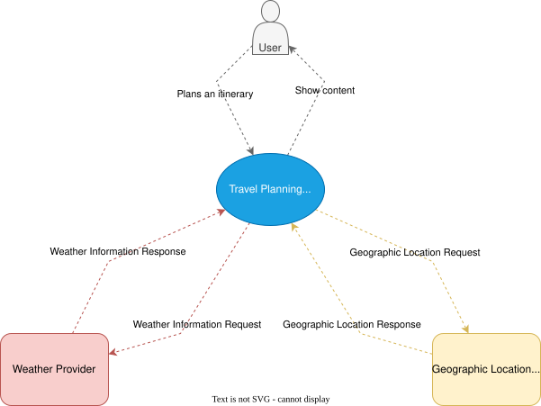
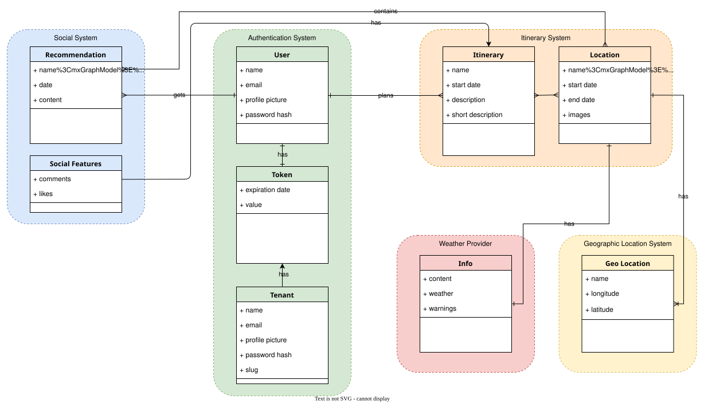
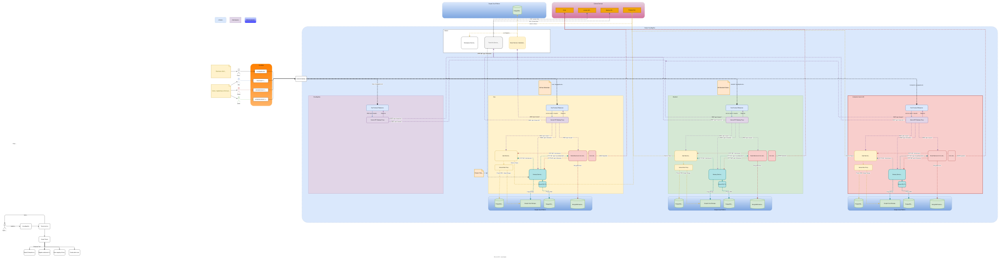
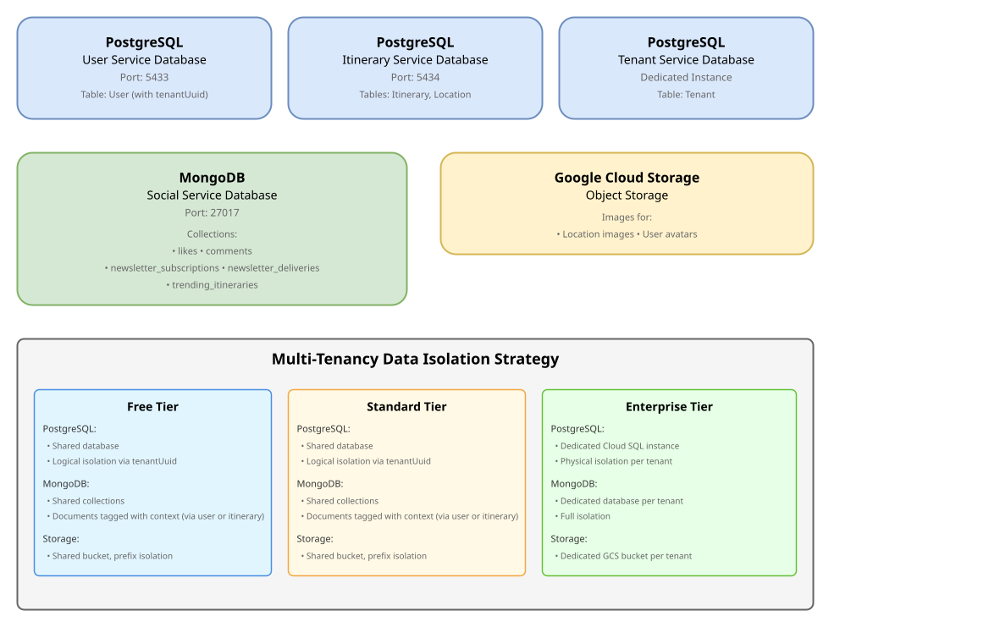
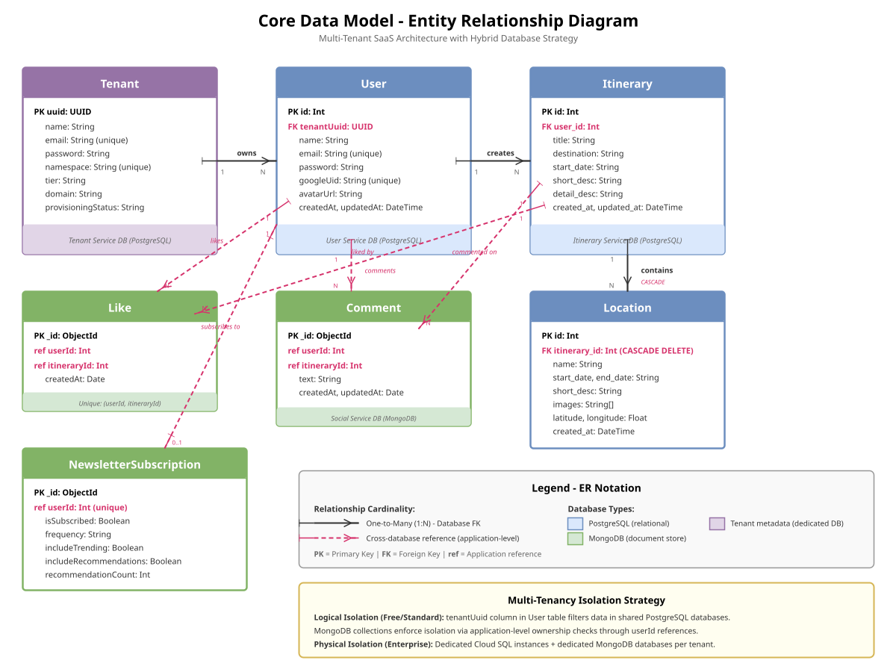
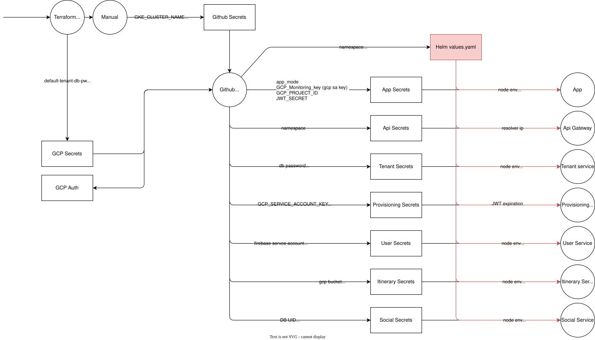
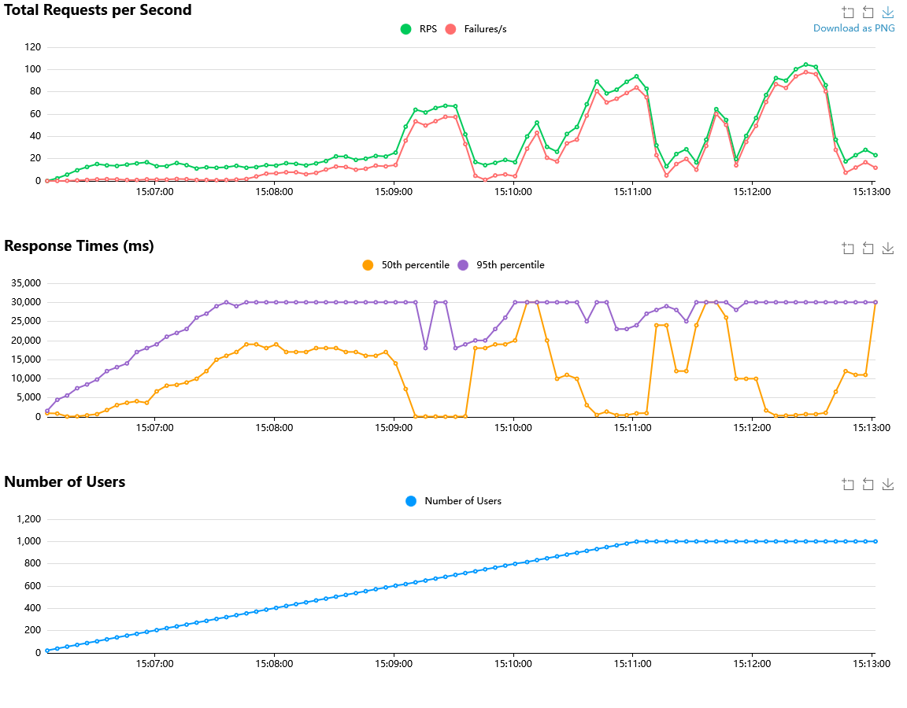
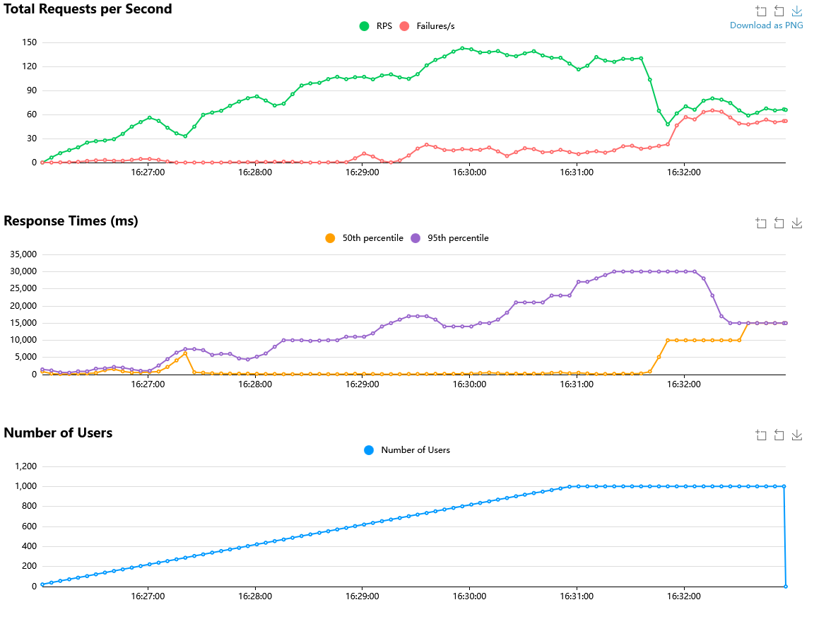
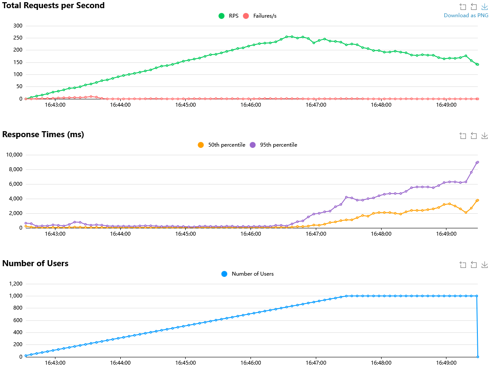

# 1 Requirements

CloudAppDev is a cloud-native B2B SaaS platform for social travel itinerary management. Users create, share, and discover travel itineraries with locations, images, and social interactions. The platform is built as a multi-tenant microservices application on Google Kubernetes Engine with three tenant tiers (Free, Standard, Enterprise).

## 1.1 System Context


**Actors:**

- **End User** -- Registers, creates itineraries, uploads images, likes/comments on content, subscribes to newsletters
- **Tenant Admin** -- Registers an organization, selects a tier, manages users within the tenant subdomain

**Neighboring Systems and External Interfaces:**

| System | Type | Purpose |
|--------|------|---------|
| **Weather Provider** | Weather information Provider | Provide weather information for a specific location & time interval |
| **Geaographic Location System** | Location Coordiantes | Provide the coordinates for a specified location or vice versa |

## 1.2 Feature Overview

| Feature | Description |
|---------|-------------|
| **User Registration & Auth** | Register via email/password. Firebase Auth issues tokens, the User Service verifies and manages profiles |
| **Itinerary Management** | Create, edit, and delete travel itineraries with title, destination, description, and date range. Each itinerary contains ordered locations with coordinates and images |
| **Image Upload** | Upload images to Google Cloud Storage via signed URLs. Images are associated with itinerary locations or user avatars |
| **Search & Discovery** | Search itineraries by destination or keyword. Browse public itineraries from other users |
| **Social Interactions** | Like and comment on itineraries. Stored in MongoDB for high-throughput read/write |
| **Email Newsletter** | Automated weekly newsletter with personalized content: trending destinations, engagement summaries, and quality-filtered itineraries. Kubernetes CronJob scheduling with retry logic |
| **Travel Information** | Weather data for itinerary destinations via external API integrations |
| **Multi-Tenancy** | Three-tier tenant model (Free, Standard, Enterprise) with subdomain-based routing, tier-specific resource limits, and infrastructure isolation for enterprise tenants |
| **Tenant Self-Service** | Organizations register, choose a tier, and receive a provisioned subdomain with automated infrastructure setup |

## 1.3 Domain Model



**Core Entities and Relationships:**

**User** (PostgreSQL -- User Service)
- Attributes: `id`, `name`, `email`, `password`, `googleUid`, `avatarUrl`, `tenantUuid`
- A User belongs to one Tenant (via `tenantUuid`)
- A User creates many Itineraries

**Itinerary** (PostgreSQL -- Itinerary Service)
- Attributes: `id`, `user_id`, `title`, `destination`, `start_date`, `short_desc`, `detail_desc`, `created_at`
- An Itinerary belongs to one User
- An Itinerary has many Locations

**Location** (PostgreSQL -- Itinerary Service)
- Attributes: `id`, `itinerary_id`, `name`, `latitude`, `longitude`, `images[]`
- A Location belongs to one Itinerary
- Images stored as GCS URLs in an array field

**Like** (MongoDB -- Social Service)
- Attributes: `userId`, `itineraryId`, `createdAt`
- Unique compound index on `(userId, itineraryId)` prevents duplicate likes

**Comment** (MongoDB -- Social Service)
- Attributes: `userId`, `itineraryId`, `text`, `createdAt`
- Indexed on `(itineraryId, createdAt)` for efficient retrieval

**Newsletter Subscription** (MongoDB -- Social Service)
- Attributes: `userId`, `isSubscribed`, `frequency`, `preferences`
- Tracks user opt-in status and delivery preferences

**Tenant** (PostgreSQL -- Tenant Service)
- Attributes: `id`, `name`, `tier`, `domain`, `createdAt`
- A Tenant has many Users
- Tier determines infrastructure isolation level (shared vs. dedicated)

**Weather** (External API -- Travel Info Service)
- Attributes: `temp_c`, `feelslike_c`, `condition`, `wind_kph` (current); `date`, `maxtemp_c`, `mintemp_c`, `avgtemp_c`, `daily_chance_of_rain` (forecast)
- Queried per Location name with configurable forecast days
- Provides value-added travel insights for itinerary destinations

**Geographic Location** (External API -- Travel Info Service)
- Attributes: `lat`, `lon`, `name`, `address` (city, town, village, municipality)
- Supports forward geocoding (location name to coordinates) and reverse geocoding (coordinates to city name)
- Used to resolve coordinates for itinerary Locations


# 2 Runtime View

## 2.1 Runtime Overview
Since this Diagram is fairly large and provides a complete overview of the runtime setup please open this link [HERE](https://github.com/CloudAppDevProject/CloudAppDev/wiki/Microservice-architecture) for a better oiverview. Rightclick the image and open in new tab. Alternative the drawio source file is located under: `<repository>/docs/microservice_architecture.drawio.svg`


**Cloud Resources (GCP):**

| Resource | Service | Configuration |
|----------|---------|---------------|
| **GKE Autopilot** | Compute | Regional cluster (`europe-west1`), automatic node provisioning and scaling |
| **Cloud SQL (PostgreSQL 16)** | Database | Shared instances for Free/Standard tiers; dedicated instances per Enterprise tenant |
| **FireStore - MongoDB** | Database | Self-managed on GKE for social data (comments, likes, newsletter) |
| **Cloud Storage** | Object Storage | Regional buckets for image uploads. Shared bucket for Free/Standard, dedicated per Enterprise |
| **Artifact Registry** | Container Registry | `europe-west1-docker.pkg.dev` hosts all Docker images |
| **Secret Manager** | Secrets | Stores database credentials, API keys, Firebase keys per namespace/tenant |
| **Certificate Manager** | SSL/TLS | Google-managed certificates for all tenant subdomains |
| **Cloud DNS / Cloudflare** | DNS | Subdomain routing: `{tenant}.dev.cloudappdev.site` |

**External Gateway (GKE Gateway API):**

All external traffic enters the cluster through a single GKE Gateway resource (`main-gateway`) in the `default` namespace, using the `gke-l7-global-external-managed` GatewayClass. This provisions a Google Cloud Global External HTTP(S) Load Balancer with a reserved static IPv4 address (`main-gateway-ip`).

The Gateway listens on two ports:

| Listener | Port | Behavior |
|----------|------|----------|
| `http` | 80 | Redirects to HTTPS (301) |
| `https` | 443 | SSL/TLS termination, routes to backend services |

Both listeners allow routes from all namespaces (`from: All`), enabling tenant-specific HTTPRoutes in separate namespaces to attach to the shared Gateway.

**SSL/TLS:** Google-managed certificates are provisioned per domain via Google Certificate Manager with Cloudflare DNS validation. A centralized Certificate Map (`cloudappdev-dev-cert-map`) aggregates all certificates (main domain and tenant subdomains) and is referenced by the Gateway via annotation.

**Subdomain Routing:** Each tenant receives a subdomain (`{tenant}.dev.cloudappdev.site`) with a Cloudflare DNS A record pointing to the Gateway's static IP. Hostname-based HTTPRoutes direct traffic to the correct namespace:

- `dev.cloudappdev.site` routes to the `app` service in the `default` namespace
- `{tenant}.dev.cloudappdev.site` routes to the `app` service in the tenant's namespace (e.g., `enterprise-{tenant}`)

Tenant domains and certificates are dynamically provisioned by the Infrastructure Provisioner via Terraform, using a separate state file (`dev-tenants`) to avoid conflicts with base infrastructure changes.

**Synchronous Services:**

The Next.js frontend and all NestJS microservices operate synchronously via REST. Client requests flow: Browser -> Next.js server-side API proxy routes -> API Gateway -> target microservice. The server-side proxy ensures the API Gateway URL is never exposed to the browser.

**Asynchronous Services:**

The Email Newsletter runs as a Kubernetes CronJob (every Sunday at 20:00 UTC). It calls the Social Service's `/newsletter/send-weekly` endpoint, which processes users in batches of 50 with 5 concurrent email sends. Failed sends are retried with exponential backoff (up to 3 retries). Delivery status is tracked in MongoDB.

**Running Application:**
!! ONLY THEORATICAL SINCE THE PROJECT HAS BEEN SHUT DOWN !!
- Production: `dev.cloudappdev.site`
- GCP Console: Google Cloud Console for project `cloudappdev-dev`

## 2.2 Microservices

### API Gateway (Nginx) ###

The Nginx API Gateway is the single entry point for all backend traffic. It runs as a pod in each namespace and routes requests by path prefix:

| Path | Target Service | Port |
|------|---------------|------|
| `/api/v1/auth`, `/api/v1/users` | User Service | 8080 |
| `/api/v1/itineraries` | Itinerary Service | 8081 |
| `/api/v1/social` | Social Service | 8082 |
| `/api/v1/travel-info` | Travel Info Service | 8083 |
| `/api/v1/tenants` | Tenant Service | 8084 |
| `/health` | Gateway self-check | -- |

The gateway uses namespace-scoped environment variables (`USER_NAMESPACE`, `ITINERARY_NAMESPACE`, etc.) to resolve service DNS names dynamically, enabling the same image to serve different namespaces. Client body size is set to 50 MB for image uploads. The Social Service has a 120-second timeout for newsletter batch operations.

### User Service (Port 8080)

**Purpose:** User registration, authentication, and profile management.

**Runtime Configuration:**
- NestJS application with `@nestjs/config` for environment variables
- Firebase Admin SDK verifies authentication tokens
- Prisma ORM connects to PostgreSQL (Cloud SQL via Cloud SQL Proxy sidecar)
- JWT secret per namespace for token signing

**Scaling:**
- Free: 1 replica, no autoscaling
- Standard: 1-5 replicas, HPA at 75% CPU
- Enterprise: 2-20 replicas, HPA at 70% CPU

**Security:**
- Firebase token verification on protected endpoints
- Passwords hashed with bcrypt
- Database credentials injected via Kubernetes Secrets (sourced from Google Secret Manager)
- Cloud SQL Proxy handles encrypted database connections

**External Connections:** Cloud SQL (PostgreSQL), Firebase Auth, Google Cloud Storage (avatar uploads)

**Multi-Tenancy Isolation:**
- Free/Standard: Shared database, logical isolation via `tenantUuid` column on User table
- Enterprise: Dedicated Cloud SQL instance and Kubernetes namespace

---

### Itinerary Service (Port 8081)

**Purpose:** CRUD operations for itineraries and locations, image upload management.

**Runtime Configuration:**
- NestJS with Prisma ORM connecting to a separate PostgreSQL database
- Google Cloud Storage client for signed URL generation and image management
- Cloud SQL Proxy sidecar for database connectivity

**Scaling:**
- Same tier-based scaling as User Service (1 / 1-5 / 2-20 replicas)

**Security:**
- JWT verification for authenticated endpoints
- Signed URLs for GCS uploads (time-limited, scoped to bucket)
- Database credentials via Kubernetes Secrets

**External Connections:** Cloud SQL (PostgreSQL), Google Cloud Storage

**Multi-Tenancy Isolation:**
- Free/Standard: Shared database, queries filtered by user ownership and tenantUid
- Enterprise: Dedicated Cloud SQL instance and dedicated GCS bucket

---

### Social Service (Port 8082)

**Purpose:** Likes, comments, and email newsletter functionality.

**Runtime Configuration:**
- NestJS with Mongoose ODM connecting to MongoDB
- Newsletter module with SMTP transport (SendGrid or Gmail)
- Handlebars templates for newsletter HTML rendering
- Trending itinerary cache with 24-hour TTL

**Scaling:**
- Same tier-based scaling as other services
- Newsletter batching (50 users per batch, 5 concurrent sends) prevents overload

**Security:**
- JWT verification for social endpoints
- SMTP credentials via Kubernetes Secrets
- Newsletter unsubscribe tokens for GDPR compliance

**External Connections:** MongoDB, SMTP/SendGrid, User Service and Itinerary Service (for newsletter content enrichment)

**Multi-Tenancy Isolation:**
- Free/Standard: Shared MongoDB, documents tagged with tenant context
- Enterprise: Dedicated MongoDB database

---

### Travel Info Service (Port 8083)

**Purpose:** External travel data aggregation -- weather information, flight schedules, and travel warnings.

**Runtime Configuration:**
- NestJS with `@nestjs/axios` for external HTTP API calls
- Deployed in the `default` namespace as a shared service across all tiers

**Scaling:**
- Shared across all tiers, scales independently in the default namespace

**Security:**
- API keys for external services stored in Kubernetes Secrets
- No direct database -- stateless request proxy

**External Connections:** Weather APIs, flight data providers

**Multi-Tenancy Isolation:**
- Shared service -- no tenant-specific data stored. Serves all tiers equally.

---

### Tenant Service (Port 8084)

**Purpose:** Tenant registration, plan management, and subdomain resolution.

**Runtime Configuration:**
- NestJS with Prisma ORM connecting to a dedicated PostgreSQL database for tenant metadata
- Deployed in the `default` namespace

**External Connections:** Cloud SQL (PostgreSQL)

**Multi-Tenancy Isolation:**
- Central service -- manages tenant metadata. Not tenant-scoped itself.

---

### Provisioning Service

**Purpose:** Automated infrastructure provisioning for new tenants.

**Runtime Configuration:**
- NestJS microservice in the `default` namespace
- Executes Terraform commands for infrastructure creation
- Manages Kubernetes deployments via `kubectl` and Helm
- RBAC ClusterRole with permissions to create namespaces, secrets, deployments, services, HPAs, and gateway resources

**External Connections:** Terraform (GCS state backend), Kubernetes API, Google Secret Manager

**Deployment Updater (CronJob):**
The Provisioning Service includes a deployment synchronization module that keeps all microservices across all namespaces up to date. A Kubernetes CronJob (`deployment-sync-cronjob`) triggers the sync endpoint periodically (every 10 minutes in dev, daily at 3:01 AM UTC in production). The sync process:

1. Queries Google Artifact Registry for the latest semantic version tag of each service image
2. Lists all Kubernetes deployments running `cloudappdev-*` images across provisioned namespaces
3. Compares running image tags against the latest available versions
4. Performs `helm upgrade` on outdated deployments with the correct per-environment values

The CronJob uses a lightweight `curl` container that POSTs to `provisioning-service:8090/deployment-update/sync`. Concurrent executions are forbidden (`concurrencyPolicy: Forbid`), and a startup sync also runs automatically when the Provisioning Service boots. Status and results are queryable via `GET /deployment-update/sync-status` and `GET /deployment-update/status`.

---

## 2.3 Datastores

### Overview

The application uses a **polyglot persistence** strategy with three storage types:



1. **PostgreSQL** (relational) — User Service, Itinerary Service, Tenant Service
2. **MongoDB** (document) — Social Service (likes, comments, newsletter data)
3. **Google Cloud Storage** (object) — Image storage for locations and user avatars

### Data Model




### Multi-Tenancy Data Isolation

| Tier | PostgreSQL | MongoDB | Cloud Storage |
|------|-----------|---------|---------------|
| **Free** | Shared DB, filtered by `tenantUuid` | Shared collections, no tenant field (filtered via user ownership) | Shared bucket, prefix isolation |
| **Standard** | Shared DB, filtered by `tenantUuid` | Shared collections, no tenant field (filtered via user ownership) | Shared bucket, prefix isolation |
| **Enterprise** | Dedicated Cloud SQL instance per tenant | Dedicated database per tenant | Dedicated GCS bucket per tenant |

**Logical Isolation (Free/Standard):**

- PostgreSQL queries include `WHERE tenantUuid = ?` clause automatically via query middleware
- MongoDB relies on **user ownership chain**: User → Itinerary → Comments/Likes
  - No direct `tenantId` field in MongoDB collections
  - Isolation enforced by checking `userId` belongs to authenticated tenant's users
  - Itinerary ownership verified before allowing comments/likes

**Physical Isolation (Enterprise):**

- Separate database instances prevent any cross-tenant data leakage
- Kubernetes namespace isolation with NetworkPolicies
- Dedicated service accounts per tenant with scoped IAM permissions

### Cross-Database References

**Important:** References between PostgreSQL and MongoDB are **application-level only**, not database-enforced foreign keys.

- `Comment.userId` and `Like.userId` reference `User.id` (PostgreSQL)
- `Comment.itineraryId` and `Like.itineraryId` reference `Itinerary.id` (PostgreSQL)
- Services validate existence via inter-service HTTP calls when creating social interactions

**Referential Integrity:**

- PostgreSQL: Enforced via Prisma FK constraints (`onDelete: Cascade` for Location → Itinerary)
- MongoDB: Application-level checks only


## 2.4 Security: Roles and Role Mapping

### Service Accounts (GCP IAM)

Service accounts follow the principle of least privilege and are provisioned **per namespace and per microservice** via Terraform. The `deployment` module creates three dedicated GCP service accounts for each namespace (free, standard, or enterprise tenant), each with only the IAM roles required by that service:

| Service Account Pattern | Created Per | IAM Roles |
|------------------------|-------------|-----------|
| **user-{namespace}-sa** | Namespace | Cloud SQL Client, Cloud SQL Instance User, Storage Object Admin |
| **itinerary-{namespace}-sa** | Namespace | Cloud SQL Client, Cloud SQL Instance User, Storage Object Admin |
| **social-{namespace}-sa** | Namespace | Datastore User, Datastore Index Admin |

For example, the `free` namespace has `user-free-sa`, `itinerary-free-sa`, and `social-free-sa`. An enterprise tenant `acme-corp` would get `user-acme-corp-sa`, `itinerary-acme-corp-sa`, and `social-acme-corp-sa`.

**Naming Convention:** The pattern `{service}-{namespace}-sa` is intentionally human-readable, making it immediately clear which service and tenant a service account belongs to (e.g., `itinerary-acme-corp-sa` is the Itinerary Service in the `acme-corp` namespace). This convention also enables the Terraform modules to construct and bind service account names deterministically -- the deployment module can generate all required GCP service accounts, Kubernetes service accounts, and Workload Identity bindings using only the namespace name as input, without needing to parse or decompose existing names. The same pattern is used consistently across GCP IAM, Kubernetes, and Workload Identity, so cross-referencing between layers is straightforward.

**Shared infrastructure service accounts** (in the `default` namespace):

| Service Account | Scope | IAM Roles |
|----------------|-------|-----------|
| **tenant-default-sa** | Tenant Service | Cloud SQL Client, Cloud SQL Instance User |
| **provisioning-default-sa** | Provisioning Service | Editor, Compute Admin, Storage Admin, Cloud SQL Admin, IAM Service Account Admin/Key Admin, Datastore Owner, Project IAM Admin, Secret Manager Accessor |

**Workload Identity:** All service accounts use GKE Workload Identity instead of key files. Each GCP service account is bound to a corresponding Kubernetes service account in its namespace (e.g., `free/user-free-sa` → `user-free-sa@project.iam.gserviceaccount.com`), so pods authenticate transparently without managing credentials.

### Kubernetes RBAC

| Role | Bound To | Permissions |
|------|----------|-------------|
| **provisioning-service ClusterRole** | provisioning-service-sa (default namespace) | Create/manage namespaces, secrets, service accounts, configmaps, deployments, replicasets, statefulsets, services, pods, HPAs, ingresses, gateway resources, PVCs |

### Multi-Tenancy Security Isolation

| Aspect | Free | Standard | Enterprise |
|--------|------|----------|------------|
| **Namespace** | Shared (`free`) | Shared (`standard`) | Dedicated (`{tenant-name}`) |
| **Service Accounts** | Shared per-service SAs (`*-free-sa`) | Shared per-service SAs (`*-standard-sa`) | Dedicated per-service SAs (`*-{tenant}-sa`) |
| **Database** | Shared, logical isolation (`tenantUuid`) | Shared, logical isolation (`tenantUuid`) | Dedicated Cloud SQL instances |
| **Storage** | Shared bucket, prefix isolation | Shared bucket, prefix isolation | Dedicated GCS bucket |
| **Secrets** | Namespace-scoped K8s secrets | Namespace-scoped K8s secrets | Tenant-scoped K8s secrets in dedicated namespace |
| **Network** | Shared pod network | Shared pod network | Namespace-level isolation (NetworkPolicies) |
| **Compute** | Shared pods (1 replica) | Shared pods (1-5 replicas) | Dedicated pods (2-20 replicas) |

# 3 Development View

## 3.1 Software Components

### Repository

The project uses a single monorepo hosted on GitHub: [CloudAppDev](https://github.com/Sprayer115/CloudAppDev).

**Repository structure:**

```
CloudAppDev/
├── app/                            # Next.js frontend (App Router)
│   ├── api/                        # Server-side API proxy routes
│   ├── components/                 # React UI components
│   ├── context/                    # React Context providers
│   ├── hooks/                      # Custom React hooks
│   └── [pages]/                    # Route pages (itineraries, login, profile, etc.)
├── services/                       # Backend microservices
│   ├── user-service/               # User management & authentication
│   ├── itinerary-service/          # Itinerary & location CRUD
│   ├── social-service/             # Likes, comments, newsletter
│   ├── travel-info-service/        # Weather & geocoding proxy
│   ├── tenant-service/             # Tenant registration & plan management
│   ├── provisioning-service/       # Orchestrates tenant provisioning
│   ├── seeder/                     # Unified DB seeding utility
│   └── shared/                     # Reusable guards & middleware
├── k8s/                            # Kubernetes Helm charts & manifests
├── terraform/                      # Infrastructure-as-Code (GCP)
│   ├── environments/               # dev, prod, dev-tenants
│   └── modules/                    # Reusable Terraform modules
├── nginx/                          # API Gateway config & Dockerfile
├── locust/                         # Load testing (Python)
├── seed-data/                      # Test dataset (dataset.json)
├── .github/workflows/              # CI/CD pipelines
├── docker-compose.yml              # Monolithic local setup
└── docker-compose.microservices.yml # Microservices local setup
```

### Software Components

| Component | Location | Purpose |
|-----------|----------|---------|
| **Frontend** | `app/` | Next.js web application with server-side API proxy routes to the Gateway |
| **User Service** | `services/user-service/` | Registration, authentication (Firebase), profile management |
| **Itinerary Service** | `services/itinerary-service/` | Itinerary/location CRUD, image upload via GCS signed URLs |
| **Social Service** | `services/social-service/` | Likes, comments (MongoDB), email newsletter with async CronJob |
| **Travel Info Service** | `services/travel-info-service/` | Weather data and geocoding via external APIs |
| **Tenant Service** | `services/tenant-service/` | Tenant registration, tier management, subdomain resolution |
| **Provisioning Service** | `services/provisioning-service/` | Orchestrates tenant provisioning and deployment sync |
| **API Gateway** | `nginx/` | Nginx reverse proxy routing requests by path prefix to services |
| **Seeder** | `services/seeder/` | Unified database seeding across all microservice databases |

### Programming Languages, Frameworks, and Libraries

**TypeScript** is the primary language for the frontend and all NestJS backend services. **JavaScript (ES Modules)** is used for the Infrastructure Provisioner and the Seeder. **Python** is used for load testing. **HCL** is used for Terraform infrastructure definitions.

| Component | Language | Framework | Key Libraries |
|-----------|----------|-----------|---------------|
| **Frontend** | TypeScript | Next.js, React | PrimeReact, TailwindCSS, Recharts, Leaflet, jose |
| **User Service** | TypeScript | NestJS, Prisma | Firebase Admin, Passport, @google-cloud/storage |
| **Itinerary Service** | TypeScript | NestJS, Prisma | @google-cloud/storage, Axios |
| **Social Service** | TypeScript | NestJS, Mongoose | Nodemailer, SendGrid, Handlebars |
| **Travel Info Service** | TypeScript | NestJS | Axios |
| **Tenant Service** | TypeScript | NestJS, Prisma | Passport, bcryptjs |
| **Provisioning Service** | TypeScript | NestJS | Axios, class-validator |
| **Seeder** | JavaScript | Prisma | MongoDB driver |
| **API Gateway** | Nginx config | Nginx | -- |
| **Load Tests** | Python | Locust | -- |
| **Infrastructure** | HCL | Terraform | GCP provider modules (cloudsql, storage, deployment, service-account, domain) |

# 4. DevOps

## 4.1 Environments and Initial Infrastructure Setup

Starting from a blank GCP project, the following steps provision all infrastructure before application deployment.

### Step 1: GCP Project Initialization

The script `terraform/scripts/init-env.sh` prepares the GCP project.

This enables 21 GCP APIs (Compute Engine, GKE, Cloud SQL, Artifact Registry, Secret Manager, Certificate Manager, Firestore, Cloud Storage, IAM, VPC, Load Balancing, DNS, Monitoring, Logging, etc.) and creates a GCS bucket with versioning for Terraform remote state (`gs://cloudappdev-tf-state-dev/`).

### Step 2: Base Infrastructure (Terraform)

```bash
cd terraform/environments/dev
terraform init
terraform apply
```

**Resources created:**

| Resource | Details |
|----------|---------|
| **GKE Autopilot cluster** | Regional cluster in `europe-west1`, fully managed node provisioning |
| **Namespaces** | `free`, `standard`, `default` (shared services) |
| **Cloud SQL instances** | PostgreSQL databases per tier via the `cloudsql` module. Passwords auto-generated and stored in Secret Manager |
| **Firestore databases** | NoSQL databases for social service per tier |
| **Cloud Storage buckets** | Image storage per tier via the `storage` module |
| **Service accounts** | `app-sa`, `tenant-default-sa`, `provisioning-default-sa` with Workload Identity bindings (via `service-account` module) |
| **RBAC ClusterRole** | Provisioning Service permissions for namespace/deployment/secret/gateway management (`rbac.tf`) |
| **Static external IP** | Global IP for the HTTPS load balancer |
| **Gateway API resources** | HTTP and HTTPS listeners with certificate map |
| **Certificate Manager** | Google-managed SSL certificate for `dev.cloudappdev.site` (via `domain` module) |
| **Cloudflare DNS record** | A-record pointing hostname to the static IP |

The infrastructure is organized in reusable Terraform modules:
- `modules/deployment` -- full namespace infrastructure (databases, storage, service accounts)
- `modules/cloudsql` -- PostgreSQL instance with password generation and Secret Manager storage
- `modules/service-account` -- IAM bindings for Cloud SQL, Storage, Firestore, Artifact Registry
- `modules/domain` -- DNS authorization, SSL certificate, certificate map entry
- `modules/storage` -- GCS bucket with lifecycle rules
- `modules/firestore` -- Firestore database provisioning

### Step 3: Tenant Infrastructure State

A second, separate Terraform state is initialized for dynamic tenant provisioning.

State: `gs://cloudappdev-tf-state-dev/env/dev-tenants`

This state is managed automatically by the Provisioning Service at runtime. Keeping it separate from the base state prevents `terraform apply` on base infrastructure from accidentally deleting dynamically provisioned tenant resources.

### Step 4: Container Registry and Secrets

- Docker images are pushed to `europe-west1-docker.pkg.dev/{project}/docker-repo/`
- Database passwords, API keys (JWT, Firebase, SendGrid, Weather API), and service account keys are stored in Google Secret Manager
- The CI/CD pipeline retrieves these secrets and creates Kubernetes Secrets per namespace during deployment

The following diagram illustrates how secrets and configuration data flow from their sources to the deployed services:



### Step 5: First Deployment

The GitHub Actions pipeline (`build-and-push-dev.yml`) performs the initial deployment: builds all service images, pushes them to Artifact Registry, creates namespace secrets from Secret Manager, and deploys via Helm to `free`, `standard`, and `default` namespaces.

After this, the platform is operational at `https://dev.cloudappdev.site`.

---

## 4.2 Pipelines and Release of New Features

### Branching Strategy

The project follows **Git Flow** with three branch types:

```
master (production) ← develop (staging) ← feature/* (development)
```

**Branch Types:**
- **Feature branches** (`feature/*`): Created from `develop`, trigger CI/CD to dev environment, auto-version `0.0.BUILD_NUMBER`
- **Develop branch**: Integration branch, deploys to development cluster, may contain unstable features
- **Master branch**: Production-ready code, semantic versioning `MAJOR.MINOR.PATCH`, requires manual approval

**Rationale**: Isolates production from active development while enabling rapid iteration in dev environment. Feature branches allow parallel development without conflicts.

---

### CI/CD Pipeline Architecture

The pipeline uses **GitHub Actions + Terraform + Helm** to automate builds and deployments with intelligent change detection.

#### Pipeline Triggers

**Automatic Triggers:**
- Push to `develop` or `feature/*` branches
- Changes in application code (`app/**`, `services/**`, `nginx/**`, `Dockerfile`)

**Manual Triggers:**
- Build all services
- Build specific service (dropdown selection)

**Rationale**: Selective builds reduce pipeline time by 60-80% by only building changed services. Manual triggers enable emergency deployments and testing.

---

#### Pipeline Stages

**1. Prepare Stage**
- Detect changed files using path filters
- Generate version number (`0.0.BUILD_NUMBER` for dev, `MAJOR.MINOR.PATCH` for prod)
- Create build matrix with services to build
- Generate short SHA for traceability

**2. Build and Push Stage**
- Parallel Docker builds for all changed services (multi-stage builds for optimization)
- Tag images with `latest`, version number, and `sha-abc1234`
- Push to Google Artifact Registry (europe-west1)
- Add metadata labels (version, environment, git SHA, service ID)

**3. Deploy Stage**
- Authenticate to GKE cluster
- Retrieve secrets from Google Secret Manager (database credentials, API keys)
- Deploy services to tier-specific namespaces using Helm
- Apply tier-based resource limits (CPU, memory, replicas)
- Verify deployment health (rollout status, pod health checks)

**Rationale**: Three-stage pipeline ensures separation of concerns: analyze → build → deploy. Parallel builds maximize efficiency. Health checks prevent broken deployments reaching production.

---

### Multi-Tenant Deployment Strategy

Services deploy to different namespaces based on tenant tier:

| Namespace | Services Deployed | Purpose |
|-----------|-------------------|---------|
| **cloudappdev** | Frontend, API Gateway | Admin/primary namespace |
| **free** | All 5 services (shared) | Free tier tenants share these pods |
| **standard** | All 5 services (shared) | Standard tier tenants share these pods |
| **default** | Tenant Service, Travel Info, Provisioner | Shared services for all tiers |
| **enterprise-*** | All 5 services (dedicated) | Each enterprise tenant gets own namespace |

**Tier-Based Resource Allocation:**

| Tier | CPU | Memory | Replicas | Autoscaling |
|------|-----|--------|----------|-------------|
| **Free** | 50m-200m | 64Mi-128Mi | 1 | Disabled |
| **Standard** | 100m-500m | 128Mi-256Mi | 2-4 | Enabled |
| **Enterprise** | 250m-1000m | 256Mi-512Mi | 3-10 | Enabled |

**Rationale**: Free/Standard tiers share infrastructure to minimize costs (95% reduction vs dedicated). Enterprise tenants get isolated namespaces for performance and security. Resource limits prevent noisy neighbors and ensure fair usage.

**Service Discovery**: API Gateway routes requests to correct namespace via environment variables (`USER_NAMESPACE=${DEPLOYMENT_NAMESPACE}`). Shared services (travel-info, tenant-service) always route to `default` namespace.

---

### Environment-Specific Deployment

**Development Environment:**
- **Trigger**: Push to `develop` or `feature/*`
- **Version**: Auto-increment `0.0.BUILD_NUMBER`
- **Namespaces**: cloudappdev, free, standard
- **Duration**: 10-15 minutes end-to-end
- **Benefits**: Rapid feedback, early integration testing, no production impact

**Production Environment:**
- **Trigger**: Push to `master` (manual approval required)
- **Version**: Semantic versioning with git tags
- **Namespaces**: All (including enterprise)
- **Safety**: Pre-deployment validation, health checks, automatic rollback on failure
- **Duration**: 15-25 minutes with approval gates

**Rationale**: Separate clusters prevent development changes from affecting production. Automatic dev deployment enables fast iteration. Manual production approval adds safety gate for critical changes.

---

### Pipeline Optimizations

**Build Optimizations:**
- Docker layer caching (50-70% faster builds)
- Multi-stage builds (image size reduced 300MB → 150MB)
- Parallel service builds
- Selective builds (only changed services)

**Deployment Optimizations:**
- Helm release management (automatic cleanup of stuck releases)
- Idempotent namespace provisioning
- Rolling updates (zero-downtime deployments)
- Progressive rollout for production

**Rationale**: Optimizations reduce pipeline time from 30+ minutes to 10-15 minutes for typical changes. Faster feedback improves developer productivity. Zero-downtime deployments maintain service availability.

---

## 4.3 Creation of New Tenants

### Overview

Tenant provisioning is **fully automated** via the **Provisioning Service** (NestJS microservice). The process varies by tier:
- **Free/Standard**: Lightweight provisioning (SSL + routing only)
- **Enterprise**: Full infrastructure provisioning (dedicated namespace + databases + services)


### Tenant Creation Workflow

The following diagram illustrates the complete tenant registration and provisioning workflow:


---

### Tenant Creation Workflow

**Phase 1: User Registration (Manual - ~5 minutes)**

1. **Register Organization**: User provides organization name and contact info
2. **Choose Plan**: Select tier (Free/Standard/Enterprise)
3. **Specify Subdomain**: User chooses subdomain (e.g., `acme-corp.dev.cloudappdev.site`)
4. **Create Admin Credentials**: Set password for admin account

**Phase 2: Infrastructure Provisioning (Automatic - 2-15 minutes)**

5. **Provision Infrastructure**: Provisioning Service executes Terraform + Kubernetes deployments
   - Updates `tenants.tfvars` with new tenant
   - Runs `terraform apply` to create cloud resources
   - Deploys Kubernetes resources (namespace or HTTPRoute)
   
6. **Tier-Specific Provisioning**:
   - **Enterprise**: Creates dedicated namespace with all services
   - **Free/Standard**: Creates HTTPRoute to shared namespace

7. **Save Tenant Data**: Stores tenant UUID and metadata in database
8. **Create Admin User**: Hashes password and associates with tenant ID

**Phase 3: User Onboarding (Manual - ~5 minutes)**

9. **Login**: Admin user accesses tenant-specific subdomain
10. **Configure Organization**: Set organization settings and preferences
11. **Invite Users**: Additional users register on tenant subdomain

**Rationale**: Only ~10 minutes of manual user interaction required. All complex infrastructure provisioning (the time-consuming part) is fully automated, reducing time-to-market and eliminating human error.

---

### Tier-Specific Provisioning

#### Free/Standard Tier Provisioning (~2 minutes)

**Infrastructure Created via Terraform:**
- Cloudflare DNS record (subdomain)
- Google-managed SSL certificate
- Certificate mapping to load balancer

**Kubernetes Resources Created:**
- HTTPRoute pointing to shared namespace services
- No dedicated pods, databases, or storage

**Resource Usage**: Shares existing pods in `free` or `standard` namespace. Tenant isolation via application-layer filtering (tenant ID).

**Cost**: ~€0/month (shared infrastructure)

**Rationale**: Lightweight provisioning enables unlimited free/standard tenants at near-zero marginal cost. Shared infrastructure maximizes resource utilization while HTTPRoute provides SSL and domain isolation.

---

#### Enterprise Tier Provisioning (~10-15 minutes)

**Infrastructure Created via Terraform:**
- Cloudflare DNS record
- Google-managed SSL certificate
- **2× Cloud SQL PostgreSQL databases** (users, itinerary)
- **Firestore database** (social service)
- **Cloud Storage bucket** (image uploads)
- Database credentials stored in Google Secret Manager

**Kubernetes Resources Created:**
- **Dedicated namespace** (`acme-corp`)
- **5 microservices deployed**:
  - User Service (port 8080)
  - Itinerary Service (port 8081)
  - Social Service (port 8082)
  - Frontend/Next.js (port 80)
  - API Gateway/NGINX (port 8000)
- **Kubernetes secrets** (database URLs, JWT secrets, API keys)
- **HTTPRoute** routing subdomain to namespace services
- **Autoscaling** (2-20 replicas per service)

**Cost**: ~€150/month (dedicated infrastructure)

**Rationale**: Dedicated infrastructure provides performance isolation, scalability, and security for enterprise customers. Higher costs justified by premium pricing (€249+/month). Full namespace isolation enables custom configurations and SLA guarantees.

---

### Provisioning Service Implementation

**API Endpoint**: `POST /provision-tenant`

**Execution Flow:**

1. **Sanitize Tenant Name**: Convert to lowercase, remove invalid characters
2. **Update Terraform Config**: Add tenant to `tenants.tfvars`
3. **Run Terraform Apply**: Provision cloud resources (DNS, SSL, databases, storage)
4. **Conditional Deployment**:
   - **Enterprise**: Deploy full namespace via Helm (5 services × Helm charts)
   - **Free/Standard**: Deploy HTTPRoute only via Helm
5. **Return Response**: Success/failure with infrastructure details

**Error Handling & Rollback:**
- **Terraform Failure**: Remove tenant from `tenants.tfvars` (no infrastructure created)
- **Kubernetes Failure**: Remove tenant from `tenants.tfvars` (may leave orphaned cloud resources)
- **Retry Logic**: Terraform state lock conflicts retry with 10-second backoff
- **Logging**: All errors logged with full context (tenant ID, tier, stage, stack trace)

**Rationale**: Single API endpoint handles complex multi-step provisioning. Automatic rollback ensures clean state on failure. Retry logic handles transient errors. Comprehensive logging enables troubleshooting.

---

### Tier Comparison Summary

| Aspect | Free | Standard | Enterprise |
|--------|------|----------|------------|
| **Provisioning Time** | ~2 min | ~2 min | ~10-15 min |
| **Infrastructure** | SSL + DNS | SSL + DNS | SSL + DNS + DB + Storage + Namespace |
| **Kubernetes** | HTTPRoute only | HTTPRoute only | Dedicated namespace (5 services) |
| **Database** | Shared | Shared | Dedicated PostgreSQL + Firestore |
| **Storage** | Shared bucket | Shared bucket | Dedicated bucket |
| **Namespace** | Shared (`free`) | Shared (`standard`) | Dedicated (`tenantName`) |
| **Replicas** | 1 (shared) | 1-5 (shared) | 2-20 (dedicated) |
| **Resource Isolation** | Application-level | Application-level | Namespace + infrastructure |

---

### Benefits of Implementation

**1. Full Automation**: Single API call provisions complete tenant infrastructure (no manual Terraform or kubectl commands)

**2. Cost Optimization**: Free/Standard tiers share infrastructure (95% cost reduction vs dedicated). Enterprise tier pays for dedicated resources.

**3. Scalability**: Can provision thousands of free/standard tenants. Enterprise tenants scale independently with autoscaling.

**4. Security**: Namespace isolation (Enterprise), unique database credentials, secrets stored in Secret Manager.

**5. Reliability**: Comprehensive rollback on failure, retry logic for transient errors, health checks verify successful deployment.

**6. Developer Experience**: Simple API, rich error messages, async processing.

**7. Business Enablement**: Freemium strategy (low-cost free tier), clear upgrade path (free → standard → enterprise), resource accountability per tier.

---

### Summary

**CI/CD Pipeline**: Intelligent build system that only builds changed services, deploys to tier-specific namespaces with appropriate resource limits, and verifies health before completion. Development pipeline provides rapid feedback (10-15 min), production pipeline adds safety gates.

**Tenant Provisioning**: Fully automated infrastructure provisioning that adapts to tenant tier. Free/Standard tenants provision in ~2 minutes with shared infrastructure. Enterprise tenants provision in ~10-15 minutes with dedicated infrastructure. Only ~10 minutes of manual user interaction required for complete onboarding.

### Service Health Monitoring

All microservices expose a `/health` endpoint that returns service status. GKE uses these for Kubernetes probes:

| Probe | Purpose | Configuration |
|-------|---------|---------------|
| **Startup Probe** | Waits for service initialization | HTTP GET `/health`, failure threshold 30, period 10s |
| **Liveness Probe** | Restarts unresponsive pods | HTTP GET `/health`, failure threshold 3, period 30s |
| **Readiness Probe** | Removes pod from traffic if unhealthy | HTTP GET `/health`, failure threshold 3, period 10s |

The API Gateway also exposes a `/health` endpoint that verifies its own availability.

### CI/CD Pipeline Monitoring

The GitHub Actions pipeline provides deployment-level observability:
- Build status per service (success/failure/skipped)
- Deployment rollout verification via `kubectl rollout status`
- Pod health checks after each deployment
- Helm release status tracking with stuck release detection and cleanup


## 5. Performance Testing

### 5.1 Test Approach and Modifications

The standardized test guideline (Periodic + Once-in-a-Lifetime Workload) was adapted for this phase: Instead of maximizing individual load scenarios, a **unified, moderate load across three infrastructure setups** was compared. This optimizes costs (Firebase quotas, DB operations) and focuses on practical infrastructure assessment.

**Unified Test Profile**: 
- Ramp: 10 users (warmup) → 1000 users over 5 minutes → 2 minutes at peak
- Total duration: 7 minutes
- Spawn rate: ~3 users/sec (200/min, below Firebase 400/min limit)
- Framework: Locust (Python), Target: https://iii.dev.cloudappdev.site


---

## 5.2 Test Setup: Architecture and Transaction Mix

**Microservice Stack**: Next.js Frontend → Nginx Gateway → User/Itinerary/Social/Travel-Info Microservices → MongoDB/PostgresDBs

**Transaction Mix** (identical across all 3 tests):
- Search Itineraries (40%, Weight 3): Primary activity
- View Itinerary (26%, Weight 2): Display details
- Create Itinerary (26%, Weight 2): Create new travel plans
- Comments & Likes (8%, Weight 1 each): Social features

**User Initialization**: Dynamic registration with Firebase Auth (max ~400 reg/min rate-limit), then login, then transactions weighted by task distribution.

**Initialization Data**: Minimal (max. 50-100 predefined itineraries); test creates new users/comments at runtime.

---

## 5.3 Test Results and Infrastructure Comparison

### Metrics Summary

**Free-Tier Results** (from Locust test):
- Failures begin around ~300  users
- High failure ratio: 15496 failures / 11496 requests
- Mechanism: Resource exhaustion or rate limiting at low concurrency



**Standard-Tier Results** (from Locust test):
- Stable and error-free up to ~600  users
- Errors begin increasing after 600 users
- High error ratio only reached after 1000+ users at sustained load



**Enterprise-Tier Results** (from Locust test):
- No failures observed across entire test duration
- Response times increase under load but no error conditions
- Continues accepting and processing all requests



---

## 5.4 Bottleneck Analysis

### Test Results by Tier:

**Free-Tier Failure Pattern** (Locust data):
- Fails early at ~300 concurrent users with systematic high failure rate
- Hard limit: Once concurrency exceeds capacity, majority of requests fail
- Likely bottleneck: Resource exhaustion (connection pool, memory, or request queue)

**Standard-Tier Degradation Pattern** (Locust data):
- Remains stable up to ~600 concurrent users
- Failures emerge gradually between 600-1000 users
- High error ratio only after sustained load at 1000+ users
- Soft limit: System degrades gracefully rather than catastrophic failure
- visible dips where ressources are horizontally balanced

**Enterprise-Tier Stability Pattern** (Locust data):
- Zero failures across entire test duration (up to 1000+ concurrent users)
- No hard limit encountered in test scope
- Performance impact: Increased response times only, no error conditions

---

## 5.5 Summary

### Key Findings from Test Data:

1. **Free-Tier**: Hard limit at ~300 concurrent users - majority of requests fail beyond this point
2. **Standard-Tier**: Soft limit around 600-1000 concurrent users - gradual error increase until defined limit of ressources is reached, not catastrophic
3. **Enterprise-Tier**: No observable limit within test scope - stable with graceful performance degradation

### What This Means:

- **Scaling behavior differs by tier**: Free fails suddenly, Standard fails gradually, Enterprise doesn't fail
- **Failure mode differences suggest different bottleneck types**: 
  - Free-Tier likely hits connection/resource pool hard limit
  - Standard-Tier hits soft resource limit allowing gradual degradation
  - Enterprise-Tier has sufficient resources for test scope
- **Infrastructure investment provides linear scaling improvement**: Each tier handles roughly 2-3x more users before failures


# 6. Commercial Aspects

## 6.1 Tenant Types

The platform implements a B2B SaaS multi-tenancy model with three tiers that differ in functional capabilities, resource thresholds, and isolation levels.

### Tenant Type Overview

| Aspect | Free | Standard | Enterprise |
|--------|------|----------|------------|
| **Namespace** | Shared (`free`) | Shared (`standard`) | Dedicated per tenant |
| **PostgreSQL** | Shared (logical isolation) | Shared (logical isolation) | Dedicated instances |
| **MongoDB** | Shared collections | Shared collections | Dedicated database |
| **Cloud Storage** | Shared bucket | Dedicated bucket | Dedicated bucket |
| **Compute Pods** | Shared replicas | Shared with priority | Dedicated pods (2-20) |
| **Domain** | {name}.cloudappdev.site | {name}.cloudappdev.site | Custom or {name}.cloudappdev.site |

### Functional Capabilities

**Free Tier:**
- Max 3 itineraries, 5 users, 100 comments
- 500MB storage, 10K API requests/day
- No newsletter, best-effort availability
- Community support only

**Standard Tier:**
- 50 itineraries, 20 users, unlimited comments
- 2GB storage, 300K API requests/month
- Newsletter enabled
- Email support, 99.5% SLA, daily backups
- Limited customization

**Enterprise Tier:**
- Unlimited itineraries and users
- 100GB storage, 1M API requests/month
- Unlimited newsletter recipients
- Dedicated support, 99.9% SLA
- Full customization

### Thresholds

**Compute Resources:**
- Free: CPU 50-200m, Memory 128-256Mi
- Standard: CPU 100-500m, Memory 256-512Mi
- Enterprise: CPU 500-2000m, Memory 1-2Gi

**API Rate Limits:**
- Free: 100 req/min burst, 10K/day (hard limit)
- Standard: 300K/month included
- Enterprise: 1M/month included

**Storage Caps:**
- Free: 500MB (hard limit)
- Standard: 2GB included
- Enterprise: 100GB included

### Isolation

**Data Isolation:**
- Free/Standard: Logical isolation via `tenant_id` column in shared databases
- Enterprise: Physical isolation with dedicated PostgreSQL instances and MongoDB databases

**Network Isolation:**
- Free/Standard: No network isolation (shared namespace)
- Enterprise: Kubernetes NetworkPolicies restrict cross-namespace traffic, dedicated endpoints

**Resource Isolation:**
- Free/Standard: Shared compute resources with quotas
- Enterprise: Dedicated CPU/memory limits per namespace, isolated Cloud SQL instances

### Provisioning

Tenants are provisioned via Infrastructure-Provisioner Service:
- Free/Standard: Automatic provisioning (sub-minute)
- Enterprise: Terraform-based provisioning (5-10 minutes), dedicated namespace deployment

## 6.2 Pricing Model

### Free Tier - 0.00 €/month

**Target Market**: Hobbyists, personal projects, product evaluation

**Included Resources**:
- Custom subdomain (e.g., `mytravel.dev.cloudappdev.site`)
- 3 travel itineraries (routes)
- 5 user accounts per tenant
- 500MB image storage
- 10,000 API requests/day (300K/month)
- 100 comments, unlimited likes
- Community support (documentation only)
- Weekly backups, 90-day data retention
- No SLA (best-effort availability)

**Compute Resources**: Shared pool (CPU: 50m-200m, Memory: 128-256Mi)

**Rationale**: Serves as product demo and viral marketing channel. Minimal marginal cost (~0.72 €/tenant/month) enables large user base for conversion funnel. Target 5-10% conversion to paid tiers.

**Quota Enforcement**: Hard limits at application layer. When exceeded, users see upgrade prompts with blocked functionality (HTTP 402 for storage, HTTP 429 for API rate limits).

---

### Standard Tier - 19.99 €/month (Base Fee)

**Target Market**: Power users, frequent travelers, small teams

**Pricing Structure**: Hybrid (Fixed base + usage-based overages)

**Base Fee (19.99 €/month) Includes**:
- 50 routes (itineraries)
- 20 user accounts
- 2GB image storage
- 300,000 API requests/month
- Newsletter functionality (SendGrid integration)
- Priority email support (24-48h response)
- Daily backups, 2-year retention
- 99.5% uptime SLA

**Usage-Based Pricing (Beyond Base Quotas)**:

| Resource | Overage Pricing | Monthly Cap | Calculation |
|----------|----------------|-------------|-------------|
| **Storage** | 0.05 € per GB | 10.00 € (at 202GB) | Daily average × 0.05 €/GB |
| **API Requests** | 0.10 € per 1,000 requests | 50.00 € | (Total - 300K) × 0.0001 € |
| **Newsletter** | 0.01 € per recipient | 10.00 € (1,000 recipients) | Recipients × 0.01 € |

**Total Monthly Range**: 19.99 € - 89.99 € (with all caps applied)

**Compute Resources**: CPU 100-500m, Memory 256-512Mi, 1-5 autoscaling replicas

**Rationale**: Base fee of 19.99 € covers infrastructure costs with 25-28% margin on typical usage. Usage-based pricing aligns costs with customer value and prevents abuse. Caps protect customers from bill shock while maintaining profitability.

**Metering**: Real-time via Google Cloud Monitoring (storage: daily snapshots, API requests: counter per request, newsletter: SendGrid webhooks)

---

### Enterprise Tier - From 249.00 €/month

**Target Market**: Travel agencies, tour operators, corporate teams, white-label partners

**Pricing Structure**: Custom quote based on requirements

**Base Configuration (249 €/month)**:
- Dedicated Kubernetes namespace
- Dedicated PostgreSQL databases (2 instances)
- Dedicated Firestore database
- Dedicated Cloud Storage bucket
- 100GB storage included
- 1,000,000 API requests/month included
- Unlimited routes and users
- Custom subdomain or BYOD (Bring Your Own Domain)
- 99.9% uptime SLA
- Dedicated support (4-hour response)
- Daily backups + point-in-time recovery

**Add-On Pricing**:
- Additional storage: 0.03 € per GB/month (bulk discount vs Standard)
- Additional compute node: 50 €/month
- Dedicated node pool: 150 €/month
- White-label branding: 1,000 € one-time setup
- Multi-region deployment: 200 €/month per region
- Professional services: 150 €/hour

**Typical Configurations**:
- Small (249-350 €/month): 50-100 users, 100GB storage, 1M API requests
- Medium (350-600 €/month): 100-500 users, 250GB storage, 5M requests, custom integrations
- Large (600-1,500 €/month): 500+ users, 1TB storage, 20M+ requests, multi-region, dedicated support

**Compute Resources**: CPU 500m-2000m, Memory 1-2Gi per service, 2-20 autoscaling replicas

**Contract Terms**: 6-month minimum commitment, 500 € setup fee (waived for annual contracts)

**Rationale**: Value-based pricing reflecting dedicated infrastructure and premium features. Base pricing at €249 achieves 22% margin with optimized configuration. Typical customers at €399-699/month reach 30-40% margins. Custom pricing enables negotiation for large contracts while protecting profitability.

---

### Pricing Parameter Definitions

#### Storage Calculation
```
Monthly Storage Cost = Base Fee + (Total GB - Included GB) × Price per GB

Free Tier:     Hard cap at 500MB (no overage allowed)
Standard Tier: (Total GB - 2GB) × 0.05 €/GB (if Total GB > 2GB)
Enterprise Tier: (Total GB - 100GB) × 0.03 €/GB (if Total GB > 100GB)
```

**Measurement**: Monthly average from daily snapshots. Includes all Cloud Storage images. Deleted files removed within 24 hours. No versioning.

#### API Request Calculation
```
Monthly API Cost = (Total Requests - Included Requests) × Price per Request

Free Tier:     Hard cap at 300K/month (rate limited at 10,000/day)
Standard Tier: (Total - 300K) × 0.0001 €/request (if Total > 300K)
Enterprise Tier: (Total - 1M) × 0.00005 €/request (if Total > 1M)
```

**What Counts as API Request**:
- ✅ All backend HTTP requests (GET, POST, PUT, DELETE)
- ✅ Frontend API calls (itineraries, comments, likes, user profiles)
- ✅ Image uploads/downloads
- ✅ Authentication requests
- ❌ Static asset serving (CDN cached)
- ❌ Health checks
- ❌ Internal service-to-service calls

**Metering**: Counted at NGINX API Gateway, logged to Cloud Monitoring, aggregated per tenant ID.

---

### Tier Comparison Summary

| Feature | Free | Standard | Enterprise |
|---------|------|----------|------------|
| **Price** | 0 € | 19.99 €/mo | 249+ €/mo |
| **Routes** | 3 | 50 | Unlimited |
| **Users** | 5 | 20 | Unlimited |
| **Storage** | 500MB | 2GB + overages | 100GB + overages |
| **API Requests** | 300K/mo | 300K/mo + overages | 1M/mo + overages |
| **Newsletter** | Disabled | 0.01 €/recipient | Unlimited |
| **CPU** | 50-200m | 100-500m | 500-2000m |
| **Memory** | 128-256Mi | 256-512Mi | 1-2Gi |
| **Replicas** | 1 (shared) | 1-5 | 2-20 |
| **SLA** | None | 99.5% | 99.9% |
| **Support** | Community | Email (24-48h) | Dedicated (4h) |
| **Backups** | Weekly | Daily | Daily + PITR |

---

## 6.3 Cost Model

### Shared Infrastructure Costs (Monthly)

These fixed costs serve all tenants regardless of tier:

| Component | Monthly Cost | Notes |
|-----------|--------------|-------|
| **GKE Cluster** | 170.31 € | Control plane (72 €) + 3 nodes (72.81 €) + disks (25.50 €) |
| **Networking** | 35.06 € | Load balancer (18.26 €) + SSL (free) + egress (16.80 €) |
| **Shared Services** | 15.75 € | Tenant service (3.50 €) + Travel info (3.50 €) + Provisioning (8.75 €) |
| **Monitoring & Logging** | 18.10 € | Cloud Monitoring (12.90 €) + Logging (5.00 €) + Errors (0.20 €) |
| **Shared Databases** | 17.84 € | PostgreSQL users (7.67 €) + itinerary (7.67 €) + backups (2.50 €) |
| **Total** | **257.06 €** | Allocated across all paying customers |

**Allocation Strategy**: Shared costs divided equally among Standard and Enterprise tenants. Free tier excluded from allocation to minimize friction.

---

### Per-Tenant Costs by Tier

#### Free Tier - 0.72 €/tenant/month

**Marginal Cost Breakdown**:
- Compute (shared pool): 0.50 €/month (50m CPU, 128Mi memory amortized)
- Storage (500MB max): 0.063 €/month (0.013 € Cloud Storage + 0.05 € database)
- Bandwidth (~0.5GB): 0.06 €/month
- Monitoring: 0.10 €/month

**Rationale**: Near-zero marginal cost enables large user base. Main cost is opportunity cost of shared resources. Break-even requires 4% conversion rate to Standard tier.

**Scenarios**:
- **Best Case** (100 tenants): 72 €/month cost, 10% conversion = 10 Standard = 199.90 € revenue → ✅ Profitable
- **Average Case** (500 tenants): 360 €/month cost, 5% conversion = 25 Standard = 499.75 € revenue → ✅ Profitable  
- **Worst Case** (1,000 tenants): 720 €/month cost, 2% conversion = 20 Standard = 399.80 € revenue → ❌ Loss (320 €/month)

**Risk Mitigation**: Monitor conversion rates closely. If <4%, tighten quotas or implement time-based limits (e.g., 90-day trial).

---

#### Standard Tier - 30.15 €/tenant/month total cost

**Direct Cost Breakdown**:
  - Compute (shared replicas): 18.00 €/month (5 services × dedicated resources during peaks)
  - Storage (2GB base): 0.052 €/month
  - Database (shared): 1.53 €/month (10% allocation of shared PostgreSQL)
  - Bandwidth (~5GB): 0.60 €/month
  - Monitoring: 3.08 €/month (logs + custom metrics)
  - Support (email): 2.00 €/month (amortized)
  - **Direct Subtotal**: 25.21 €/month

**Allocated Infrastructure**: 4.94 €/month (assuming 50 Standard + 2 Enterprise tenants share 257.06 €)

**Total Cost**: 30.15 €/month

**Revenue Analysis**:
- Base fee only: 19.99 €/month → **❌ Loss of 10.16 €/month**
- With avg overages (7 €/mo): 26.99 €/month → **❌ Loss of 3.16 €/month**
- With typical usage (17 €/mo overage): 36.99 €/month → **✅ Profit 6.84 €/month (23% margin)**
- With high usage (55 €/mo overage): 74.99 €/month → **✅ Profit 44.84 €/month (60% margin)**

**Scenarios**:

| Scenario | Revenue | Cost | Margin | Likelihood |
|----------|---------|------|--------|------------|
| **Worst** (no overage) | 19.99 € | 30.15 € | -10.16 € (-34%) | 15% of users |
| **Average** (moderate usage) | 36.99 € | 30.15 € | 6.84 € (23%) | 60% of users |
| **Best** (high usage) | 74.99 € | 30.15 € | 44.84 € (60%) | 25% of users |

**Weighted Average**: (0.15 × -10.16 €) + (0.60 × 6.84 €) + (0.25 × 44.84 €) = **13.94 €/month profit (38% margin)**

**Rationale**: Base price of 19.99 € deliberately set below full cost recovery to maintain competitive positioning and psychological pricing (sub-20 €). Profitability depends on usage-based revenue, which aligns incentives: higher usage = more customer value = more revenue. Average customer achieves 23% margin.

**Break-Even**: Requires 10.16 € in monthly overages (achievable with typical usage patterns: 5GB storage overage + 100K extra API calls + 200 newsletter recipients = 0.25 € + 10 € + 2 € = 12.25 €).

---

#### Enterprise Tier - 384.66 €/tenant/month (ongoing)

**Direct Cost Breakdown**:
  - Compute (dedicated): 202.50 €/month (2 replicas per service × 5 services)
    - Frontend: 2 × (500m CPU, 1Gi memory) = 45 €
    - User Service: 2 × (500m CPU, 1Gi memory) = 45 €
    - Itinerary Service: 2 × (500m CPU, 1Gi memory) = 45 €
    - Social Service: 2 × (500m CPU, 1Gi memory) = 45 €
    - API Gateway: 2 × (250m CPU, 512Mi memory) = 22.50 €
  - Databases (dedicated): 105.66 €/month
    - Users DB: db-n1-standard-1 = 45.33 €
    - Itinerary DB: db-n1-standard-1 = 45.33 €
    - Firestore: Dedicated database = 10.00 €
    - Backups: 7-day retention = 5.00 €
  - Storage (100GB): 2.60 €/month
  - Networking (~50GB egress): 6.00 €/month
  - Monitoring (dedicated): 17.90 €/month (logs + dashboards)
  - Support (dedicated): 50.00 €/month (fractional CSM allocation)
  - **Total Ongoing**: 384.66 €/month

**First-Year Cost**: 426.33 €/month (includes 41.67 €/month amortized provisioning setup fee)

**Revenue Analysis at Base Pricing (249 €/month)**:
- Base fee: 249 €/month
- Typical add-ons: 50 €/month (storage overages, custom features)
- **Total Revenue**: 299 €/month
- **Margin**: 299 € - 384.66 € = **❌ Loss of 85.66 €/month (-22%)**

**Break-Even Price**: 384.66 €/month  
**Target Price for 30% Margin**: 384.66 € / 0.70 = **549.51 €/month**

**Scenarios**:

| Configuration | Monthly Cost | Revenue | Margin | Recommendation |
|---------------|--------------|---------|--------|----------------|
| **Optimized** (1 replica, db-f1-micro) | 245.33 € | 249 € base | 3.67 € (1.5%) | Minimum viable |
| **Standard** (2 replicas, db-n1-standard-1) | 384.66 € | 399 € adjusted | 14.34 € (3.7%) | Requires price increase |
| **Premium** (2 replicas + add-ons) | 384.66 € | 549 € target | 164.34 € (30%) | Ideal target |
| **High-Scale** (10 replicas, peak usage) | 1,192.50 € | 249 € base | -943.50 € (-79%) | ⚠️ Risk scenario |

**Rationale**: 
- Base price of 249 € is **strategically underpriced** to compete with market and secure enterprise deals
- Requires either: (1) infrastructure optimization (smaller databases, fewer replicas) OR (2) price adjustment to 399-549 €
- High-scale risk mitigated through resource quotas and autoscaling limits configured per contract
- Profitability achieved through add-ons (white-label, multi-region, professional services)

**Recommended Strategy**:
1. Set base configuration as **optimized** (1 replica, db-f1-micro) at 249 € → 1.5% margin
2. Offer **standard configuration** (2 replicas, db-n1-standard-1) at 399 € → 3.7% margin  
3. Upsell **premium features** (multi-region, white-label) to reach 549+ € → 30% margin
4. Reserve **high-scale configurations** for custom quotes only (800-1,500 €/month range)

---

### Aggregate Cost Scenarios

#### Scenario 1: Early Stage (0-6 months)

**Customer Mix**:
- 500 Free tenants
- 20 Standard tenants  
- 1 Enterprise tenant

**Monthly Costs**:
  - Shared infrastructure: 257.06 €
  - Free tier: 500 × 0.72 € = 360.00 €
  - Standard tier: 20 × 30.15 € = 603.00 €
  - Enterprise tier: 1 × 426.33 € = 426.33 €
  - **Total**: 1,646.39 €/month

**Monthly Revenue**:
- Free: €0
  - Standard: 20 × 36.99 € (with avg overages) = 739.80 €
  - Enterprise: 1 × 299 € = 299.00 €
  - **Total**: 1,038.80 €/month

**Result**: **❌ Loss of 607.59 €/month (-37% margin)**

**Break-Even Requirements**: Need 3 more Enterprise tenants OR 35 more Standard tenants (with average overages)

---

#### Scenario 2: Growth Stage (6-18 months)

**Customer Mix**:
- 200 Free tenants (reduced through conversion)
- 50 Standard tenants
- 5 Enterprise tenants

**Monthly Costs**:
  - Shared infrastructure: 257.06 €
  - Free tier: 200 × 0.72 € = 144.00 €
  - Standard tier: 50 × 30.15 € = 1,507.50 €
  - Enterprise tier: 5 × 384.66 € = 1,923.30 €
  - **Total**: 3,831.86 €/month

**Monthly Revenue**:
- Free: €0
  - Standard: 50 × 36.99 € = 1,849.50 €
  - Enterprise: 5 × 399 € (adjusted pricing) = 1,995.00 €
  - **Total**: 3,844.50 €/month

**Result**: **✅ Profit of 12.64 €/month (0.3% margin)**

**Break-Even Achieved**: Minimal profitability at scale with adjusted pricing

---

#### Scenario 3: Mature Stage (18+ months)

**Customer Mix**:
- 100 Free tenants (low activity, mostly dormant)
- 30 Standard tenants (power users with high overages)
- 10 Enterprise tenants (optimized configurations + add-ons)

**Monthly Costs**:
  - Shared infrastructure: 257.06 €
  - Free tier: 100 × 0.50 € = 50.00 € (low activity reduces costs)
  - Standard tier: 30 × 30.15 € = 904.50 €
  - Enterprise tier: 10 × 245.33 € = 2,453.30 € (optimized infrastructure)
  - **Total**: 3,664.86 €/month

**Monthly Revenue**:
- Free: €0
  - Standard: 30 × 55.00 € (high usage) = 1,650.00 €
  - Enterprise: 10 × 449 € (base + add-ons) = 4,490.00 €
  - **Total**: 6,140.00 €/month

**Result**: **✅ Profit of 2,475.14 €/month (40% margin)**

**Target Achieved**: Healthy profitability with balanced customer mix and optimized infrastructure

---

### Cost Optimization Opportunities

#### Infrastructure Optimization (Potential Savings: €600-800/month)
1. **GKE Autopilot**: 15% reduction in compute costs through better bin-packing
2. **Preemptible VMs**: 60% savings on non-critical workloads (monitoring, batch jobs)
3. **Committed Use Discounts**: 37% savings on databases with 3-year commitment
4. **Regional Consolidation**: 20% reduction in networking costs (single region vs multi-region)

#### Operational Efficiency (Potential Savings: €200-400/month)
1. **Multi-Tenancy Density**: Increase free/standard tenants per node from 10 to 20
2. **Vertical Pod Autoscaling**: Right-size resources dynamically (reduce overprovisioning by 25%)
3. **Database Connection Pooling**: Reduce database instance count by 50%

#### Strategic Pricing Adjustments (Revenue Increase: €1,500-2,000/month at 50 customers)
1. **Standard Tier**: Current pricing optimal (€19.99 base achieves target margin with overages)
2. **Enterprise Tier**: Adjust base pricing to €399-549 range (30% margin target)
3. **Free Tier**: Implement time-based limits (90-day trial) or tighter quotas to drive conversion

---

### Summary & Recommendations

**Current State**: Platform operates at a loss in early stage due to customer acquisition costs and infrastructure overhead.

**Path to Profitability**:
1. **Immediate**: Adjust Enterprise pricing to 399 € minimum (achieves break-even)
2. **Short-term** (3 months): Optimize infrastructure (target 600 €/month savings)
3. **Medium-term** (6 months): Reach 30 Standard + 5 Enterprise customers (break-even point)
4. **Long-term** (12 months): Target 30 Standard + 10 Enterprise customers (40% margin, 2,500 €/month profit)

**Profitability Milestones**:
- **Break-Even**: 15 Enterprise tenants @ 399 € OR 100 Standard tenants @ 37 €/month (with overages)
- **Target Margin (30%)**: 10 Enterprise @ 549 € + 30 Standard @ 55 €/month
- **Optimal Mix**: 60% revenue from Enterprise (predictable), 40% from Standard (volume)